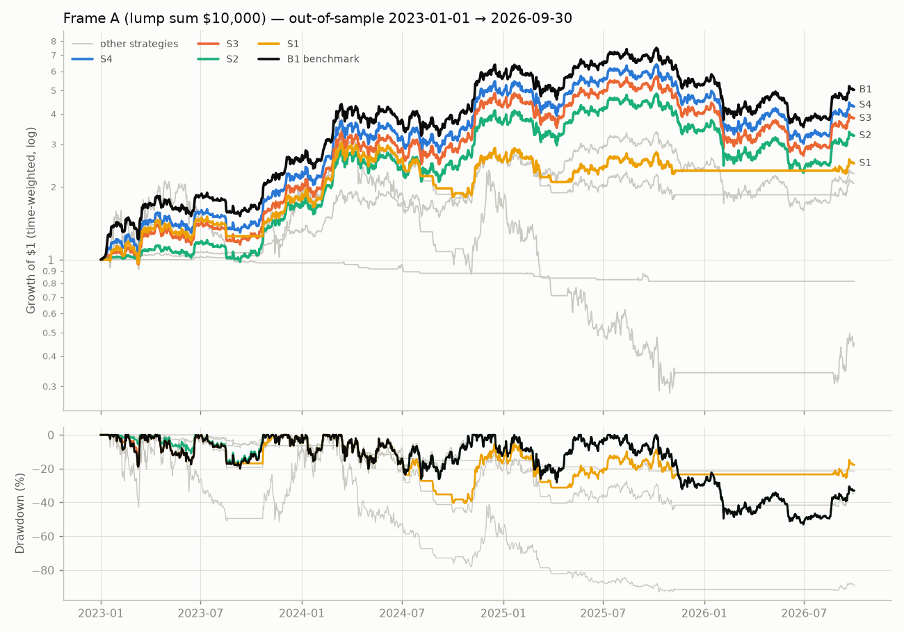
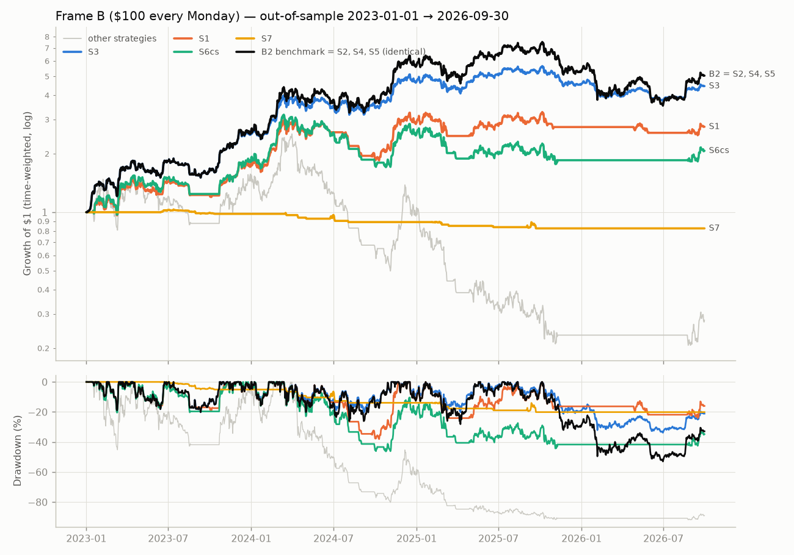

# Lab 2 — BTC-centric halal strategies (spot, long-only)

## Verdict

**No BTC-centric approach beat the simple benchmarks out-of-sample (2023-01 → 2026-09).** Lump sum: buy & hold made Calmar 1.02 (max drawdown 53%); the best strategy, S4, reached 0.90, and the DCA-style rules (S2–S5) ended almost fully invested, so they sat through the same 53% drawdown with less upside. The lowest drawdown (apart from the mostly-cash S7) came from S1: 40%, in the market 65% of the time, but it gave up too much return (Calmar 0.69). Weekly $100: plain DCA turned contributions into 1.62×; S2, S4, S5 matched it exactly, because their ×2/×3 multipliers can only spend a saved cash reserve and in 2023–26 there were almost no 'expensive' weeks to save in; the best non-tied rule, S3, made 1.51× with a 34% drawdown (vs 53%) and 49% of DCA's BTC per dollar — less risk, but not more money. Alt momentum rotation inside BTC uptrends (S6) was the worst idea tested: -19% a year with a 93% drawdown, confirming Lab 1. The Fibonacci pullback (S7) took only 14 out-of-sample trades, too few to judge (INCONCLUSIVE), and lost money on them (-5.3% a year). Several rules looked better than the benchmarks in-sample (2018–22 bear-heavy) and lost that edge after 2022 — the textbook overfitting pattern. Practical read: the bar to beat is still plain buy & hold / weekly DCA; drawdown filters (S1, S3) buy a smaller drawdown with lower returns, which these pass rules count as a failure.

## Ranking by out-of-sample result — Frame A — lump sum $10,000

Out-of-sample = 2023-01-01 → 2026-09-30, run once with parameters chosen on 2018-01-01 → 2022-12-31. Sorted by Calmar.

| # | Strategy | Label | Params | Final | CAGR | Max DD | Calmar | Sharpe | In market | Fills | Turnover/yr |
|---|---|---|---|---|---|---|---|---|---|---|---|
|  | **B1 buy & hold** (benchmark) | – | – | $50,477 | 54.1% | 53.0% | 1.02 | 1.16 | 100.0% | 1 | 0.07× |
| 1 | **S4** Log-regression band | ❌ FAIL | `trim_z=1.5` | $43,001 | 47.6% | 53.0% | 0.90 | 1.07 | 99.9% | 11 | 0.08× |
| 2 | **S3** Drawdown-from-ATH DCA | ❌ FAIL | `x=0.5, n_weeks=12` | $38,381 | 43.2% | 53.0% | 0.82 | 1.02 | 99.9% | 12 | 0.09× |
| 3 | **S2** DCA vs 200-week SMA | ❌ FAIL | `table=aggressive` | $32,557 | 37.0% | 53.0% | 0.70 | 0.94 | 99.4% | 35 | 0.10× |
| 4 | **S1** BTC regime filter | ❌ FAIL | `sma=200d` | $25,045 | 27.8% | 40.4% | 0.69 | 0.84 | 65.2% | 17 | 4.26× |
| 5 | **S6cs** Core-satellite 85% S1-BTC / 15% rotation | ❌ FAIL | `n=3, off=cash` | $20,743 | 21.5% | 46.2% | 0.47 | 0.67 | 65.2% | 515 | 9.51× |
| 6 | **S5** MVRV-Z DCA | ❌ FAIL | `k=5` | $22,703 | 24.5% | 53.0% | 0.46 | 0.76 | 98.9% | 102 | 0.14× |
| 7 | **S6** Alt momentum rotation | ❌ FAIL | `n=3, off=cash` | $4,520 | -19.1% | 92.9% | -0.21 | 0.20 | 65.2% | 545 | 46.14× |
| 8 | **S7** BTC/ETH Fibonacci 61.8% pullback | ⚠️ INCONCLUSIVE | `zigzag=0.15` | $8,147 | -5.3% | 21.3% | -0.25 | -0.89 | 13.1% | 28 | 4.06× |

## Ranking by out-of-sample result — Frame B — $100 every Monday

Out-of-sample = 2023-01-01 → 2026-09-30, run once with parameters chosen on 2018-01-01 → 2022-12-31. Sorted by final value ÷ contributed.

| # | Strategy | Label | Params | Value÷contrib. | IRR | Max DD | Calmar | Sharpe | BTC per $1k | In market | Fills | Turnover/yr |
|---|---|---|---|---|---|---|---|---|---|---|---|---|
|  | **B2 weekly DCA** (benchmark) | – | – | 1.62× | 27.0% | 52.9% | 1.02 | 1.16 | 0.0194 | 99.9% | 196 | 0.28× |
| 1 | **S2** DCA vs 200-week SMA | ❌ FAIL | `table=aggressive` | 1.62× | 27.0% | 52.9% | 1.02 | 1.16 | 0.0194 | 99.9% | 196 | 0.28× |
| 2 | **S4** Log-regression band | ❌ FAIL | `trim_z=1.5` | 1.62× | 27.0% | 52.9% | 1.02 | 1.16 | 0.0194 | 99.9% | 196 | 0.28× |
| 3 | **S5** MVRV-Z DCA | ❌ FAIL | `k=5` | 1.62× | 27.0% | 52.9% | 1.02 | 1.16 | 0.0194 | 99.9% | 196 | 0.28× |
| 4 | **S3** Drawdown-from-ATH DCA | ❌ FAIL | `x=0.5, n_weeks=12` | 1.51× | 23.1% | 33.8% | 1.45 | 1.29 | 0.0095 | 99.9% | 44 | 0.09× |
| 5 | **S1** BTC regime filter | ❌ FAIL | `sma=20w` | 1.35× | 16.5% | 38.1% | 0.82 | 0.91 | 0.0161 | 66.2% | 140 | 5.12× |
| 6 | **S6cs** Core-satellite 85% S1-BTC / 15% rotation | ❌ FAIL | `n=3, off=cash` | 1.15× | 7.4% | 46.3% | 0.46 | 0.67 | 0.0117 | 65.2% | 533 | 8.65× |
| 7 | **S7** BTC/ETH Fibonacci 61.8% pullback | ⚠️ INCONCLUSIVE | `zigzag=0.15` | 0.92× | -4.5% | 20.1% | -0.25 | -0.86 | 0.0000 | 13.1% | 28 | 3.48× |
| 8 | **S6** Alt momentum rotation | ❌ FAIL | `n=5, off=cash` | 0.59× | -26.8% | 91.8% | -0.31 | -0.05 | 0.0000 | 65.2% | 842 | 33.95× |

## Per-strategy results

Each row is a separate run starting fresh at the period start (frame A: $10,000; frame B: $0 plus $100 each Monday). IS and OOS are what the verdict uses; full period and cycles are context.

### S1 — BTC regime filter

S1: hold BTC while close > SMA (checked daily, traded on Mondays), else cash.

Parameter grid (fixed before testing): `{'sma': ['20w', '200d', '50w']}`

**Frame A: ❌ FAIL** — chosen `sma=200d` (best in-sample Calmar among 3/3 sets with drawdown ≤ benchmark's).  
- OOS Calmar 0.69 vs B1 1.02; max DD 40.4% vs 53.0%
- neighbours (OOS vs benchmark): `sma=20w` ❌, `sma=50w` ✅
- share of full-period profit by cycle: 2018–19 -2.4%, 2020–21 30.1%, 2022 1.0%, 2023–24 73.3%, 2025–26 -2.0%

| Period | Dates | Final | CAGR | Max DD | Calmar | Sharpe | In market | Fills | Turnover/yr |
|---|---|---|---|---|---|---|---|---|---|
| In-sample | 2018-01→2022-12 | $25,414 | 20.5% | 59.3% | 0.36 | 0.63 | 44.1% | 16 | 3.13× |
| ↳ B1 |  | $12,043 | 3.8% | 81.2% | 0.05 | 0.44 | 100.0% | 1 | 0.14× |
| Out-of-sample | 2023-01→2026-09 | $25,045 | 27.8% | 40.4% | 0.69 | 0.84 | 65.2% | 17 | 4.26× |
| ↳ B1 |  | $50,477 | 54.1% | 53.0% | 1.02 | 1.16 | 100.0% | 1 | 0.07× |
| Full period | 2018-01→2026-09 | $63,651 | 23.6% | 59.3% | 0.40 | 0.69 | 53.1% | 33 | 3.91× |
| ↳ B1 |  | $60,878 | 22.9% | 81.2% | 0.29 | 0.65 | 100.0% | 1 | 0.04× |
| 2018–19 | 2018-01→2019-12 | $8,733 | -6.6% | 59.3% | -0.09 | 0.19 | 36.4% | 6 | 3.25× |
| ↳ B1 |  | $5,238 | -27.7% | 81.2% | -0.33 | -0.02 | 100.0% | 1 | 0.92× |
| 2020–21 | 2020-01→2021-12 | $28,485 | 68.8% | 56.2% | 1.22 | 1.17 | 73.5% | 9 | 4.27× |
| ↳ B1 |  | $64,136 | 153.4% | 53.6% | 2.86 | 1.59 | 100.0% | 1 | 0.12× |
| 2022 | 2022-01→2022-12 | $10,000 | 0.0% | 0.0% | – | – | 0.0% | 0 | 0.00× |
| ↳ B1 |  | $3,574 | -64.4% | 66.9% | -0.98 | -1.34 | 100.0% | 1 | 1.65× |
| 2023–24 | 2023-01→2024-12 | $25,468 | 59.6% | 40.4% | 1.48 | 1.27 | 79.8% | 11 | 5.48× |
| ↳ B1 |  | $56,485 | 137.8% | 26.2% | 5.26 | 2.01 | 100.0% | 1 | 0.17× |
| 2025–26 | 2025-01→2026-09 | $9,341 | -3.8% | 27.5% | -0.14 | -0.01 | 47.6% | 7 | 3.82× |
| ↳ B1 |  | $8,923 | -6.3% | 53.0% | -0.13 | 0.06 | 100.0% | 1 | 0.60× |

**Frame B: ❌ FAIL** — chosen `sma=20w` (best in-sample final value ÷ contributed among 3/3 sets with drawdown ≤ benchmark's).  
- OOS value÷contributed 1.35 vs B2 1.62; BTC per $1k 0.0161 vs 0.0194; max DD 38.1% vs 52.9%
- neighbours (OOS vs benchmark): `sma=200d` ❌
- share of full-period profit by cycle: 2018–19 2.6%, 2020–21 41.1%, 2022 -16.9%, 2023–24 78.1%, 2025–26 -4.9%

| Period | Dates | Value÷contrib. | IRR | Max DD | Calmar | Sharpe | BTC per $1k | In market | Fills | Turnover/yr |
|---|---|---|---|---|---|---|---|---|---|---|
| In-sample | 2018-01→2022-12 | 3.01× | 46.5% | 72.7% | 0.28 | 0.62 | 0.0000 | 44.1% | 125 | 3.22× |
| ↳ B2 |  | 1.55× | 17.8% | 84.0% | 0.01 | 0.40 | 0.0936 | 100.0% | 261 | 0.13× |
| Out-of-sample | 2023-01→2026-09 | 1.35× | 16.5% | 38.1% | 0.82 | 0.91 | 0.0161 | 66.2% | 140 | 5.12× |
| ↳ B2 |  | 1.62× | 27.0% | 52.9% | 1.02 | 1.16 | 0.0194 | 99.9% | 196 | 0.28× |
| Full period | 2018-01→2026-09 | 5.30× | 36.8% | 72.7% | 0.34 | 0.71 | 0.0633 | 53.6% | 265 | 4.59× |
| ↳ B2 |  | 5.17× | 36.2% | 84.0% | 0.25 | 0.63 | 0.0618 | 100.0% | 457 | 0.05× |
| 2018–19 | 2018-01→2019-12 | 1.48× | 44.5% | 72.7% | -0.22 | -0.05 | 0.0000 | 33.6% | 40 | 2.14× |
| ↳ B2 |  | 1.09× | 9.1% | 84.0% | -0.38 | -0.10 | 0.1519 | 100.0% | 105 | 0.90× |
| 2020–21 | 2020-01→2021-12 | 2.76× | 143.5% | 36.9% | 3.40 | 1.67 | 0.0000 | 73.7% | 80 | 2.91× |
| ↳ B2 |  | 2.85× | 149.8% | 53.8% | 2.70 | 1.55 | 0.0617 | 99.3% | 104 | 0.33× |
| 2022 | 2022-01→2022-12 | 0.79× | -39.1% | 32.5% | -0.93 | -1.50 | 0.0000 | 5.8% | 5 | 4.36× |
| ↳ B2 |  | 0.66× | -59.0% | 67.3% | -0.96 | -1.26 | 0.0399 | 99.5% | 52 | 2.76× |
| 2023–24 | 2023-01→2024-12 | 1.72× | 64.8% | 38.1% | 1.82 | 1.40 | 0.0184 | 79.8% | 90 | 6.44× |
| ↳ B2 |  | 2.44× | 120.1% | 26.1% | 5.27 | 2.00 | 0.0261 | 99.9% | 105 | 0.55× |
| 2025–26 | 2025-01→2026-09 | 1.00× | 0.1% | 25.0% | -0.30 | -0.15 | 0.0120 | 49.8% | 50 | 5.22× |
| ↳ B2 |  | 0.97× | -3.1% | 52.9% | -0.21 | -0.05 | 0.0116 | 99.2% | 91 | 1.30× |

### S2 — DCA vs 200-week SMA

S2: weekly buy = base x multiplier from price / 200-week SMA; trim 10% when very extended.

Parameter grid (fixed before testing): `{'table': ['mild', 'base', 'aggressive']}`

**Frame A: ❌ FAIL** — chosen `table=aggressive` (best in-sample Calmar among 3/3 sets with drawdown ≤ benchmark's).  
- OOS Calmar 0.70 vs B1 1.02; max DD 53.0% vs 53.0%
- neighbours (OOS vs benchmark): `table=base` ❌
- share of full-period profit by cycle: 2018–19 2.7%, 2020–21 43.3%, 2022 -17.4%, 2023–24 82.2%, 2025–26 -10.8%

| Period | Dates | Final | CAGR | Max DD | Calmar | Sharpe | In market | Fills | Turnover/yr |
|---|---|---|---|---|---|---|---|---|---|
| In-sample | 2018-01→2022-12 | $65,317 | 45.6% | 62.9% | 0.72 | 0.99 | 87.0% | 162 | 0.33× |
| ↳ B1 |  | $12,043 | 3.8% | 81.2% | 0.05 | 0.44 | 100.0% | 1 | 0.14× |
| Out-of-sample | 2023-01→2026-09 | $32,557 | 37.0% | 53.0% | 0.70 | 0.94 | 99.4% | 35 | 0.10× |
| ↳ B1 |  | $50,477 | 54.1% | 53.0% | 1.02 | 1.16 | 100.0% | 1 | 0.07× |
| Full period | 2018-01→2026-09 | $203,145 | 41.1% | 62.9% | 0.65 | 0.97 | 92.6% | 358 | 0.13× |
| ↳ B1 |  | $60,878 | 22.9% | 81.2% | 0.29 | 0.65 | 100.0% | 1 | 0.04× |
| 2018–19 | 2018-01→2019-12 | $15,305 | 23.8% | 48.8% | 0.49 | 0.70 | 67.4% | 76 | 0.39× |
| ↳ B1 |  | $5,238 | -27.7% | 81.2% | -0.33 | -0.02 | 100.0% | 1 | 0.92× |
| 2020–21 | 2020-01→2021-12 | $40,946 | 102.4% | 35.2% | 2.91 | 1.84 | 97.4% | 86 | 0.53× |
| ↳ B1 |  | $64,136 | 153.4% | 53.6% | 2.86 | 1.59 | 100.0% | 1 | 0.12× |
| 2022 | 2022-01→2022-12 | $7,131 | -28.8% | 33.3% | -0.86 | -1.00 | 89.9% | 48 | 1.11× |
| ↳ B1 |  | $3,574 | -64.4% | 66.9% | -0.98 | -1.34 | 100.0% | 1 | 1.65× |
| 2023–24 | 2023-01→2024-12 | $36,432 | 91.0% | 26.2% | 3.48 | 1.71 | 98.9% | 35 | 0.27× |
| ↳ B1 |  | $56,485 | 137.8% | 26.2% | 5.26 | 2.01 | 100.0% | 1 | 0.17× |
| 2025–26 | 2025-01→2026-09 | $9,875 | -0.7% | 36.4% | -0.02 | 0.09 | 93.7% | 72 | 0.61× |
| ↳ B1 |  | $8,923 | -6.3% | 53.0% | -0.13 | 0.06 | 100.0% | 1 | 0.60× |

**Frame B: ❌ FAIL** — chosen `table=aggressive` (best in-sample final value ÷ contributed among 3/3 sets with drawdown ≤ benchmark's).  
- OOS value÷contributed 1.62 vs B2 1.62; BTC per $1k 0.0194 vs 0.0194; max DD 52.9% vs 52.9%
- neighbours (OOS vs benchmark): `table=base` ✅
- share of full-period profit by cycle: 2018–19 2.0%, 2020–21 45.6%, 2022 -18.3%, 2023–24 81.3%, 2025–26 -10.7%

| Period | Dates | Value÷contrib. | IRR | Max DD | Calmar | Sharpe | BTC per $1k | In market | Fills | Turnover/yr |
|---|---|---|---|---|---|---|---|---|---|---|
| In-sample | 2018-01→2022-12 | 3.48× | 52.9% | 62.8% | 0.78 | 1.02 | 0.0681 | 90.6% | 226 | 0.34× |
| ↳ B2 |  | 1.55× | 17.8% | 84.0% | 0.01 | 0.40 | 0.0936 | 100.0% | 261 | 0.13× |
| Out-of-sample | 2023-01→2026-09 | 1.62× | 27.0% | 52.9% | 1.02 | 1.16 | 0.0194 | 99.9% | 196 | 0.28× |
| ↳ B2 |  | 1.62× | 27.0% | 52.9% | 1.02 | 1.16 | 0.0194 | 99.9% | 196 | 0.28× |
| Full period | 2018-01→2026-09 | 5.81× | 38.9% | 62.8% | 0.64 | 0.97 | 0.0585 | 94.6% | 422 | 0.12× |
| ↳ B2 |  | 5.17× | 36.2% | 84.0% | 0.25 | 0.63 | 0.0618 | 100.0% | 457 | 0.05× |
| 2018–19 | 2018-01→2019-12 | 1.42× | 39.6% | 48.6% | 0.59 | 0.76 | 0.1976 | 76.6% | 88 | 0.67× |
| ↳ B2 |  | 1.09× | 9.1% | 84.0% | -0.38 | -0.10 | 0.1519 | 100.0% | 105 | 0.90× |
| 2020–21 | 2020-01→2021-12 | 2.82× | 147.7% | 53.8% | 2.66 | 1.71 | 0.0249 | 99.3% | 86 | 0.60× |
| ↳ B2 |  | 2.85× | 149.8% | 53.8% | 2.70 | 1.55 | 0.0617 | 99.3% | 104 | 0.33× |
| 2022 | 2022-01→2022-12 | 0.66× | -58.7% | 66.7% | -0.91 | -1.18 | 0.0401 | 99.5% | 52 | 2.73× |
| ↳ B2 |  | 0.66× | -59.0% | 67.3% | -0.96 | -1.26 | 0.0399 | 99.5% | 52 | 2.76× |
| 2023–24 | 2023-01→2024-12 | 2.44× | 120.1% | 26.1% | 5.27 | 2.00 | 0.0261 | 99.9% | 105 | 0.55× |
| ↳ B2 |  | 2.44× | 120.1% | 26.1% | 5.27 | 2.00 | 0.0261 | 99.9% | 105 | 0.55× |
| 2025–26 | 2025-01→2026-09 | 0.97× | -3.1% | 52.9% | -0.21 | -0.05 | 0.0116 | 99.2% | 91 | 1.30× |
| ↳ B2 |  | 0.97× | -3.1% | 52.9% | -0.21 | -0.05 | 0.0116 | 99.2% | 91 | 1.30× |

### S3 — Drawdown-from-ATH DCA

S3: buy only when BTC is >= X below its expanding ATH; otherwise save the $100.
    When triggered, the reserve saved before the episode is deployed over N weeks.

Parameter grid (fixed before testing): `{'x': [0.3, 0.4, 0.5], 'n_weeks': [4, 12]}`

**Frame A: ❌ FAIL** — chosen `x=0.5, n_weeks=12` (best in-sample Calmar among 6/6 sets with drawdown ≤ benchmark's).  
- OOS Calmar 0.82 vs B1 1.02; max DD 53.0% vs 53.0%
- neighbours (OOS vs benchmark): `x=0.4, n_weeks=12` ❌, `x=0.5, n_weeks=4` ❌
- share of full-period profit by cycle: 2018–19 -0.9%, 2020–21 51.5%, 2022 -39.2%, 2023–24 101.7%, 2025–26 -13.1%

| Period | Dates | Final | CAGR | Max DD | Calmar | Sharpe | In market | Fills | Turnover/yr |
|---|---|---|---|---|---|---|---|---|---|
| In-sample | 2018-01→2022-12 | $21,006 | 16.0% | 76.6% | 0.21 | 0.57 | 98.1% | 22 | 0.08× |
| ↳ B1 |  | $12,043 | 3.8% | 81.2% | 0.05 | 0.44 | 100.0% | 1 | 0.14× |
| Out-of-sample | 2023-01→2026-09 | $38,381 | 43.2% | 53.0% | 0.82 | 1.02 | 99.9% | 12 | 0.09× |
| ↳ B1 |  | $50,477 | 54.1% | 53.0% | 1.02 | 1.16 | 100.0% | 1 | 0.07× |
| Full period | 2018-01→2026-09 | $106,189 | 31.0% | 76.6% | 0.40 | 0.75 | 98.9% | 22 | 0.02× |
| ↳ B1 |  | $60,878 | 22.9% | 81.2% | 0.29 | 0.65 | 100.0% | 1 | 0.04× |
| 2018–19 | 2018-01→2019-12 | $9,137 | -4.4% | 64.4% | -0.07 | 0.23 | 95.2% | 22 | 0.55× |
| ↳ B1 |  | $5,238 | -27.7% | 81.2% | -0.33 | -0.02 | 100.0% | 1 | 0.92× |
| 2020–21 | 2020-01→2021-12 | $59,566 | 144.2% | 53.0% | 2.72 | 1.64 | 99.3% | 25 | 0.13× |
| ↳ B1 |  | $64,136 | 153.4% | 53.6% | 2.86 | 1.59 | 100.0% | 1 | 0.12× |
| 2022 | 2022-01→2022-12 | $6,897 | -31.1% | 35.4% | -0.88 | -0.75 | 63.0% | 12 | 1.11× |
| ↳ B1 |  | $3,574 | -64.4% | 66.9% | -0.98 | -1.34 | 100.0% | 1 | 1.65× |
| 2023–24 | 2023-01→2024-12 | $42,948 | 107.3% | 26.2% | 4.10 | 1.79 | 99.9% | 12 | 0.23× |
| ↳ B1 |  | $56,485 | 137.8% | 26.2% | 5.26 | 2.01 | 100.0% | 1 | 0.17× |
| 2025–26 | 2025-01→2026-09 | $10,335 | 1.9% | 0.8% | 2.50 | 1.28 | 14.7% | 1 | 0.05× |
| ↳ B1 |  | $8,923 | -6.3% | 53.0% | -0.13 | 0.06 | 100.0% | 1 | 0.60× |

**Frame B: ❌ FAIL** — chosen `x=0.5, n_weeks=12` (best in-sample final value ÷ contributed among 6/6 sets with drawdown ≤ benchmark's).  
- OOS value÷contributed 1.51 vs B2 1.62; BTC per $1k 0.0095 vs 0.0194; max DD 33.8% vs 52.9%
- neighbours (OOS vs benchmark): `x=0.4, n_weeks=12` ✅, `x=0.5, n_weeks=4` ❌
- share of full-period profit by cycle: 2018–19 0.8%, 2020–21 39.6%, 2022 -32.1%, 2023–24 105.1%, 2025–26 -13.4%

| Period | Dates | Value÷contrib. | IRR | Max DD | Calmar | Sharpe | BTC per $1k | In market | Fills | Turnover/yr |
|---|---|---|---|---|---|---|---|---|---|---|
| In-sample | 2018-01→2022-12 | 1.63× | 20.0% | 74.3% | 0.24 | 0.58 | 0.0987 | 98.1% | 141 | 0.13× |
| ↳ B2 |  | 1.55× | 17.8% | 84.0% | 0.01 | 0.40 | 0.0936 | 100.0% | 261 | 0.13× |
| Out-of-sample | 2023-01→2026-09 | 1.51× | 23.1% | 33.8% | 1.45 | 1.29 | 0.0095 | 99.9% | 44 | 0.09× |
| ↳ B2 |  | 1.62× | 27.0% | 52.9% | 1.02 | 1.16 | 0.0194 | 99.9% | 196 | 0.28× |
| Full period | 2018-01→2026-09 | 5.36× | 37.1% | 74.3% | 0.43 | 0.77 | 0.0605 | 98.9% | 185 | 0.03× |
| ↳ B2 |  | 5.17× | 36.2% | 84.0% | 0.25 | 0.63 | 0.0618 | 100.0% | 457 | 0.05× |
| 2018–19 | 2018-01→2019-12 | 1.14× | 14.2% | 66.0% | -0.04 | 0.27 | 0.1591 | 95.2% | 83 | 0.86× |
| ↳ B2 |  | 1.09× | 9.1% | 84.0% | -0.38 | -0.10 | 0.1519 | 100.0% | 105 | 0.90× |
| 2020–21 | 2020-01→2021-12 | 2.33× | 112.7% | 44.4% | 2.87 | 1.63 | 0.0357 | 99.3% | 25 | 0.13× |
| ↳ B2 |  | 2.85× | 149.8% | 53.8% | 2.70 | 1.55 | 0.0617 | 99.3% | 104 | 0.33× |
| 2022 | 2022-01→2022-12 | 0.76× | -43.3% | 37.8% | -0.90 | -0.81 | 0.0461 | 63.0% | 33 | 2.27× |
| ↳ B2 |  | 0.66× | -59.0% | 67.3% | -0.96 | -1.26 | 0.0399 | 99.5% | 52 | 2.76× |
| 2023–24 | 2023-01→2024-12 | 2.07× | 92.5% | 20.5% | 5.67 | 2.02 | 0.0158 | 99.9% | 43 | 0.24× |
| ↳ B2 |  | 2.44× | 120.1% | 26.1% | 5.27 | 2.00 | 0.0261 | 99.9% | 105 | 0.55× |
| 2025–26 | 2025-01→2026-09 | 1.03× | 3.8% | 0.8% | 2.61 | 1.29 | 0.0014 | 14.7% | 1 | 0.09× |
| ↳ B2 |  | 0.97× | -3.1% | 52.9% | -0.21 | -0.05 | 0.0116 | 99.2% | 91 | 1.30× |

### S4 — Log-regression band

S4: log10(price) ~ log10(days since genesis), expanding fit refit monthly.
    x2 below the midline (and redeploy 1/4 of the reserve), x1 up to +1 sigma, x0 above;
    trim 15% of holdings above +trim_z sigma (spec: 2.0).

Parameter grid (fixed before testing): `{'trim_z': [1.5, 2.0, 2.5]}`

**Frame A: ❌ FAIL** — chosen `trim_z=1.5` (best in-sample Calmar among 3/3 sets with drawdown ≤ benchmark's).  
- OOS Calmar 0.90 vs B1 1.02; max DD 53.0% vs 53.0%
- neighbours (OOS vs benchmark): `trim_z=2.0` ❌
- share of full-period profit by cycle: 2018–19 2.9%, 2020–21 49.6%, 2022 -37.7%, 2023–24 97.9%, 2025–26 -12.6%

| Period | Dates | Final | CAGR | Max DD | Calmar | Sharpe | In market | Fills | Turnover/yr |
|---|---|---|---|---|---|---|---|---|---|
| In-sample | 2018-01→2022-12 | $33,548 | 27.4% | 76.6% | 0.36 | 0.70 | 94.6% | 46 | 0.05× |
| ↳ B1 |  | $12,043 | 3.8% | 81.2% | 0.05 | 0.44 | 100.0% | 1 | 0.14× |
| Out-of-sample | 2023-01→2026-09 | $43,001 | 47.6% | 53.0% | 0.90 | 1.07 | 99.9% | 11 | 0.08× |
| ↳ B1 |  | $50,477 | 54.1% | 53.0% | 1.02 | 1.16 | 100.0% | 1 | 0.07× |
| Full period | 2018-01→2026-09 | $169,586 | 38.2% | 76.6% | 0.50 | 0.85 | 96.9% | 46 | 0.01× |
| ↳ B1 |  | $60,878 | 22.9% | 81.2% | 0.29 | 0.65 | 100.0% | 1 | 0.04× |
| 2018–19 | 2018-01→2019-12 | $14,592 | 20.8% | 49.4% | 0.42 | 0.62 | 86.6% | 46 | 0.41× |
| ↳ B1 |  | $5,238 | -27.7% | 81.2% | -0.33 | -0.02 | 100.0% | 1 | 0.92× |
| 2020–21 | 2020-01→2021-12 | $55,184 | 135.1% | 53.1% | 2.54 | 1.51 | 99.3% | 11 | 0.14× |
| ↳ B1 |  | $64,136 | 153.4% | 53.6% | 2.86 | 1.59 | 100.0% | 1 | 0.12× |
| 2022 | 2022-01→2022-12 | $5,370 | -46.4% | 49.8% | -0.93 | -1.10 | 89.9% | 28 | 1.26× |
| ↳ B1 |  | $3,574 | -64.4% | 66.9% | -0.98 | -1.34 | 100.0% | 1 | 1.65× |
| 2023–24 | 2023-01→2024-12 | $48,118 | 119.5% | 26.2% | 4.57 | 1.87 | 99.9% | 11 | 0.20× |
| ↳ B1 |  | $56,485 | 137.8% | 26.2% | 5.26 | 2.01 | 100.0% | 1 | 0.17× |
| 2025–26 | 2025-01→2026-09 | $9,897 | -0.6% | 53.0% | -0.01 | 0.18 | 93.7% | 20 | 0.55× |
| ↳ B1 |  | $8,923 | -6.3% | 53.0% | -0.13 | 0.06 | 100.0% | 1 | 0.60× |

**Frame B: ❌ FAIL** — chosen `trim_z=1.5` (best in-sample final value ÷ contributed among 3/3 sets with drawdown ≤ benchmark's).  
- OOS value÷contributed 1.62 vs B2 1.62; BTC per $1k 0.0194 vs 0.0194; max DD 52.9% vs 52.9%
- neighbours (OOS vs benchmark): `trim_z=2.0` ❌
- share of full-period profit by cycle: 2018–19 0.9%, 2020–21 42.7%, 2022 -35.3%, 2023–24 105.8%, 2025–26 -14.2%

| Period | Dates | Value÷contrib. | IRR | Max DD | Calmar | Sharpe | BTC per $1k | In market | Fills | Turnover/yr |
|---|---|---|---|---|---|---|---|---|---|---|
| In-sample | 2018-01→2022-12 | 1.65× | 20.4% | 76.3% | 0.27 | 0.62 | 0.0998 | 98.1% | 233 | 0.12× |
| ↳ B2 |  | 1.55× | 17.8% | 84.0% | 0.01 | 0.40 | 0.0936 | 100.0% | 261 | 0.13× |
| Out-of-sample | 2023-01→2026-09 | 1.62× | 27.0% | 52.9% | 1.02 | 1.16 | 0.0194 | 99.9% | 196 | 0.28× |
| ↳ B2 |  | 1.62× | 27.0% | 52.9% | 1.02 | 1.16 | 0.0194 | 99.9% | 196 | 0.28× |
| Full period | 2018-01→2026-09 | 5.46× | 37.5% | 76.3% | 0.45 | 0.79 | 0.0653 | 98.9% | 429 | 0.05× |
| ↳ B2 |  | 5.17× | 36.2% | 84.0% | 0.25 | 0.63 | 0.0618 | 100.0% | 457 | 0.05× |
| 2018–19 | 2018-01→2019-12 | 1.18× | 17.8% | 57.4% | 0.08 | 0.37 | 0.1644 | 95.2% | 96 | 0.81× |
| ↳ B2 |  | 1.09× | 9.1% | 84.0% | -0.38 | -0.10 | 0.1519 | 100.0% | 105 | 0.90× |
| 2020–21 | 2020-01→2021-12 | 2.88× | 151.8% | 53.8% | 2.73 | 1.57 | 0.0584 | 99.3% | 85 | 0.27× |
| ↳ B2 |  | 2.85× | 149.8% | 53.8% | 2.70 | 1.55 | 0.0617 | 99.3% | 104 | 0.33× |
| 2022 | 2022-01→2022-12 | 0.66× | -59.0% | 67.3% | -0.96 | -1.26 | 0.0399 | 99.5% | 52 | 2.76× |
| ↳ B2 |  | 0.66× | -59.0% | 67.3% | -0.96 | -1.26 | 0.0399 | 99.5% | 52 | 2.76× |
| 2023–24 | 2023-01→2024-12 | 2.44× | 120.1% | 26.1% | 5.27 | 2.00 | 0.0261 | 99.9% | 105 | 0.55× |
| ↳ B2 |  | 2.44× | 120.1% | 26.1% | 5.27 | 2.00 | 0.0261 | 99.9% | 105 | 0.55× |
| 2025–26 | 2025-01→2026-09 | 0.97× | -3.1% | 52.9% | -0.21 | -0.05 | 0.0116 | 99.2% | 91 | 1.30× |
| ↳ B2 |  | 0.97× | -3.1% | 52.9% | -0.21 | -0.05 | 0.0116 | 99.2% | 91 | 1.30× |

### S5 — MVRV-Z DCA

S5: x2 when MVRV-Z < 0, x1 otherwise; trim 15% of holdings when MVRV-Z > K.

Parameter grid (fixed before testing): `{'k': [5, 6, 7]}`

**Frame A: ❌ FAIL** — chosen `k=5` (best in-sample Calmar among 3/3 sets with drawdown ≤ benchmark's).  
- OOS Calmar 0.46 vs B1 1.02; max DD 53.0% vs 53.0%
- neighbours (OOS vs benchmark): `k=6` ❌
- share of full-period profit by cycle: 2018–19 2.1%, 2020–21 48.1%, 2022 -23.3%, 2023–24 84.7%, 2025–26 -11.6%

| Period | Dates | Final | CAGR | Max DD | Calmar | Sharpe | In market | Fills | Turnover/yr |
|---|---|---|---|---|---|---|---|---|---|
| In-sample | 2018-01→2022-12 | $47,884 | 36.8% | 63.1% | 0.58 | 0.87 | 97.7% | 195 | 0.32× |
| ↳ B1 |  | $12,043 | 3.8% | 81.2% | 0.05 | 0.44 | 100.0% | 1 | 0.14× |
| Out-of-sample | 2023-01→2026-09 | $22,703 | 24.5% | 53.0% | 0.46 | 0.76 | 98.9% | 102 | 0.14× |
| ↳ B1 |  | $50,477 | 54.1% | 53.0% | 1.02 | 1.16 | 100.0% | 1 | 0.07× |
| Full period | 2018-01→2026-09 | $150,863 | 36.4% | 63.1% | 0.58 | 0.90 | 98.7% | 391 | 0.12× |
| ↳ B1 |  | $60,878 | 22.9% | 81.2% | 0.29 | 0.65 | 100.0% | 1 | 0.04× |
| 2018–19 | 2018-01→2019-12 | $12,909 | 13.6% | 49.1% | 0.28 | 0.51 | 94.2% | 87 | 0.44× |
| ↳ B1 |  | $5,238 | -27.7% | 81.2% | -0.33 | -0.02 | 100.0% | 1 | 0.92× |
| 2020–21 | 2020-01→2021-12 | $28,601 | 69.2% | 30.8% | 2.24 | 1.61 | 95.5% | 108 | 0.54× |
| ↳ B1 |  | $64,136 | 153.4% | 53.6% | 2.86 | 1.59 | 100.0% | 1 | 0.12× |
| 2022 | 2022-01→2022-12 | $8,045 | -19.6% | 22.9% | -0.86 | -1.17 | 89.9% | 52 | 0.77× |
| ↳ B1 |  | $3,574 | -64.4% | 66.9% | -0.98 | -1.34 | 100.0% | 1 | 1.65× |
| 2023–24 | 2023-01→2024-12 | $25,405 | 59.4% | 23.1% | 2.57 | 1.55 | 97.9% | 102 | 0.35× |
| ↳ B1 |  | $56,485 | 137.8% | 26.2% | 5.26 | 2.01 | 100.0% | 1 | 0.17× |
| 2025–26 | 2025-01→2026-09 | $9,768 | -1.3% | 31.7% | -0.04 | 0.03 | 93.7% | 91 | 0.53× |
| ↳ B1 |  | $8,923 | -6.3% | 53.0% | -0.13 | 0.06 | 100.0% | 1 | 0.60× |

**Frame B: ❌ FAIL** — chosen `k=5` (best in-sample final value ÷ contributed among 3/3 sets with drawdown ≤ benchmark's).  
- OOS value÷contributed 1.62 vs B2 1.62; BTC per $1k 0.0194 vs 0.0194; max DD 52.9% vs 52.9%
- neighbours (OOS vs benchmark): `k=6` ❌
- share of full-period profit by cycle: 2018–19 0.6%, 2020–21 49.9%, 2022 -24.1%, 2023–24 85.2%, 2025–26 -11.7%

| Period | Dates | Value÷contrib. | IRR | Max DD | Calmar | Sharpe | BTC per $1k | In market | Fills | Turnover/yr |
|---|---|---|---|---|---|---|---|---|---|---|
| In-sample | 2018-01→2022-12 | 2.60× | 39.9% | 83.0% | 0.17 | 0.54 | 0.0590 | 100.0% | 266 | 0.34× |
| ↳ B2 |  | 1.55× | 17.8% | 84.0% | 0.01 | 0.40 | 0.0936 | 100.0% | 261 | 0.13× |
| Out-of-sample | 2023-01→2026-09 | 1.62× | 27.0% | 52.9% | 1.02 | 1.16 | 0.0194 | 99.9% | 196 | 0.28× |
| ↳ B2 |  | 1.62× | 27.0% | 52.9% | 1.02 | 1.16 | 0.0194 | 99.9% | 196 | 0.28× |
| Full period | 2018-01→2026-09 | 4.46× | 33.0% | 83.0% | 0.24 | 0.62 | 0.0422 | 100.0% | 462 | 0.11× |
| ↳ B2 |  | 5.17× | 36.2% | 84.0% | 0.25 | 0.63 | 0.0618 | 100.0% | 457 | 0.05× |
| 2018–19 | 2018-01→2019-12 | 1.09× | 9.3% | 83.0% | -0.36 | -0.08 | 0.1522 | 100.0% | 106 | 0.90× |
| ↳ B2 |  | 1.09× | 9.1% | 84.0% | -0.38 | -0.10 | 0.1519 | 100.0% | 105 | 0.90× |
| 2020–21 | 2020-01→2021-12 | 2.79× | 145.4% | 53.8% | 2.64 | 1.69 | 0.0366 | 99.3% | 108 | 0.71× |
| ↳ B2 |  | 2.85× | 149.8% | 53.8% | 2.70 | 1.55 | 0.0617 | 99.3% | 104 | 0.33× |
| 2022 | 2022-01→2022-12 | 0.66× | -59.0% | 67.3% | -0.96 | -1.26 | 0.0399 | 99.5% | 52 | 2.76× |
| ↳ B2 |  | 0.66× | -59.0% | 67.3% | -0.96 | -1.26 | 0.0399 | 99.5% | 52 | 2.76× |
| 2023–24 | 2023-01→2024-12 | 2.44× | 120.1% | 26.1% | 5.27 | 2.00 | 0.0261 | 99.9% | 105 | 0.55× |
| ↳ B2 |  | 2.44× | 120.1% | 26.1% | 5.27 | 2.00 | 0.0261 | 99.9% | 105 | 0.55× |
| 2025–26 | 2025-01→2026-09 | 0.97× | -3.1% | 52.9% | -0.21 | -0.05 | 0.0116 | 99.2% | 91 | 1.30× |
| ↳ B2 |  | 0.97× | -3.1% | 52.9% | -0.21 | -0.05 | 0.0116 | 99.2% | 91 | 1.30× |

### S6 — Alt momentum rotation

S6: when BTC > 200d SMA hold the top-N alts of the point-in-time halal top 50 by
    4-week return (equal weight, weekly rebalance); otherwise 100% BTC or cash.
    core > 0 gives the core-satellite variant: `core` in S1-BTC (200d), the rest in the rotation.

Parameter grid (fixed before testing): `{'n': [3, 5], 'off': ['btc', 'cash']}`

**Frame A: ❌ FAIL** — chosen `n=3, off=cash` (no set kept drawdown ≤ benchmark's in-sample; best in-sample Calmar).  
- OOS Calmar -0.21 vs B1 1.02; max DD 92.9% vs 53.0%
- neighbours (OOS vs benchmark): `n=5, off=cash` ❌, `n=3, off=btc` ❌
- share of full-period profit by cycle: 2018–19 -17.9%, 2020–21 275.5%, 2022 3.3%, 2023–24 185.3%, 2025–26 -346.2%

| Period | Dates | Final | CAGR | Max DD | Calmar | Sharpe | In market | Fills | Turnover/yr |
|---|---|---|---|---|---|---|---|---|---|
| In-sample | 2018-01→2022-12 | $89,620 | 55.1% | 85.0% | 0.65 | 0.93 | 44.1% | 469 | 16.51× |
| ↳ B1 |  | $12,043 | 3.8% | 81.2% | 0.05 | 0.44 | 100.0% | 1 | 0.14× |
| Out-of-sample | 2023-01→2026-09 | $4,520 | -19.1% | 92.9% | -0.21 | 0.20 | 65.2% | 545 | 46.14× |
| ↳ B1 |  | $50,477 | 54.1% | 53.0% | 1.02 | 1.16 | 100.0% | 1 | 0.07× |
| Full period | 2018-01→2026-09 | $40,512 | 17.3% | 92.9% | 0.19 | 0.62 | 53.1% | 1014 | 37.02× |
| ↳ B1 |  | $60,878 | 22.9% | 81.2% | 0.29 | 0.65 | 100.0% | 1 | 0.04× |
| 2018–19 | 2018-01→2019-12 | $4,527 | -32.8% | 79.1% | -0.41 | -0.21 | 36.4% | 142 | 17.21× |
| ↳ B1 |  | $5,238 | -27.7% | 81.2% | -0.33 | -0.02 | 100.0% | 1 | 0.92× |
| 2020–21 | 2020-01→2021-12 | $195,735 | 342.9% | 75.2% | 4.56 | 1.81 | 73.5% | 324 | 41.03× |
| ↳ B1 |  | $64,136 | 153.4% | 53.6% | 2.86 | 1.59 | 100.0% | 1 | 0.12× |
| 2022 | 2022-01→2022-12 | $10,000 | 0.0% | 0.0% | – | – | 0.0% | 0 | 0.00× |
| ↳ B1 |  | $3,574 | -64.4% | 66.9% | -0.98 | -1.34 | 100.0% | 1 | 1.65× |
| 2023–24 | 2023-01→2024-12 | $16,309 | 27.7% | 78.1% | 0.35 | 0.73 | 79.8% | 359 | 49.79× |
| ↳ B1 |  | $56,485 | 137.8% | 26.2% | 5.26 | 2.01 | 100.0% | 1 | 0.17× |
| 2025–26 | 2025-01→2026-09 | $2,526 | -54.6% | 84.3% | -0.65 | -0.70 | 47.6% | 183 | 31.65× |
| ↳ B1 |  | $8,923 | -6.3% | 53.0% | -0.13 | 0.06 | 100.0% | 1 | 0.60× |

**Frame B: ❌ FAIL** — chosen `n=5, off=cash` (no set kept drawdown ≤ benchmark's in-sample; best in-sample final value ÷ contributed).  
- OOS value÷contributed 0.59 vs B2 1.62; BTC per $1k 0.0000 vs 0.0194; max DD 91.8% vs 52.9%
- neighbours (OOS vs benchmark): `n=3, off=cash` ❌, `n=5, off=btc` ❌
- share of full-period profit by cycle: 2018–19 -15.9%, 2020–21 602.0%, 2022 35.4%, 2023–24 -10.5%, 2025–26 -511.0%

| Period | Dates | Value÷contrib. | IRR | Max DD | Calmar | Sharpe | BTC per $1k | In market | Fills | Turnover/yr |
|---|---|---|---|---|---|---|---|---|---|---|
| In-sample | 2018-01→2022-12 | 9.36× | 102.2% | 88.6% | 0.58 | 0.92 | 0.0000 | 44.1% | 722 | 16.29× |
| ↳ B2 |  | 1.55× | 17.8% | 84.0% | 0.01 | 0.40 | 0.0936 | 100.0% | 261 | 0.13× |
| Out-of-sample | 2023-01→2026-09 | 0.59× | -26.8% | 91.8% | -0.31 | -0.05 | 0.0000 | 65.2% | 842 | 33.95× |
| ↳ B2 |  | 1.62× | 27.0% | 52.9% | 1.02 | 1.16 | 0.0194 | 99.9% | 196 | 0.28× |
| Full period | 2018-01→2026-09 | 1.77× | 12.7% | 91.8% | 0.11 | 0.52 | 0.0000 | 53.1% | 1543 | 32.50× |
| ↳ B2 |  | 5.17× | 36.2% | 84.0% | 0.25 | 0.63 | 0.0618 | 100.0% | 457 | 0.05× |
| 2018–19 | 2018-01→2019-12 | 0.47× | -59.0% | 85.0% | -0.53 | -0.50 | 0.0000 | 36.4% | 228 | 22.35× |
| ↳ B2 |  | 1.09× | 9.1% | 84.0% | -0.38 | -0.10 | 0.1519 | 100.0% | 105 | 0.90× |
| 2020–21 | 2020-01→2021-12 | 9.86× | 506.5% | 62.5% | 6.41 | 2.03 | 0.0000 | 73.5% | 487 | 37.61× |
| ↳ B2 |  | 2.85× | 149.8% | 53.8% | 2.70 | 1.55 | 0.0617 | 99.3% | 104 | 0.33× |
| 2022 | 2022-01→2022-12 | 1.00× | -0.0% | 0.0% | – | – | 0.0000 | 0.0% | 0 | 0.00× |
| ↳ B2 |  | 0.66× | -59.0% | 67.3% | -0.96 | -1.26 | 0.0399 | 99.5% | 52 | 2.76× |
| 2023–24 | 2023-01→2024-12 | 0.91× | -9.2% | 80.3% | -0.01 | 0.42 | 0.0000 | 79.8% | 556 | 45.41× |
| ↳ B2 |  | 2.44× | 120.1% | 26.1% | 5.27 | 2.00 | 0.0261 | 99.9% | 105 | 0.55× |
| 2025–26 | 2025-01→2026-09 | 0.97× | -3.5% | 79.2% | -0.65 | -0.78 | 0.0000 | 47.6% | 282 | 16.87× |
| ↳ B2 |  | 0.97× | -3.1% | 52.9% | -0.21 | -0.05 | 0.0116 | 99.2% | 91 | 1.30× |

### S6cs — Core-satellite 85% S1-BTC / 15% rotation

Parameter grid (fixed before testing): `{'n': [3, 5], 'off': ['btc', 'cash']}`

**Frame A: ❌ FAIL** — chosen `n=3, off=cash` (best in-sample Calmar among 4/4 sets with drawdown ≤ benchmark's).  
- OOS Calmar 0.47 vs B1 1.02; max DD 46.2% vs 53.0%
- neighbours (OOS vs benchmark): `n=5, off=cash` ❌, `n=3, off=btc` ❌
- share of full-period profit by cycle: 2018–19 -2.4%, 2020–21 42.1%, 2022 1.1%, 2023–24 82.8%, 2025–26 -23.6%

| Period | Dates | Final | CAGR | Max DD | Calmar | Sharpe | In market | Fills | Turnover/yr |
|---|---|---|---|---|---|---|---|---|---|
| In-sample | 2018-01→2022-12 | $38,579 | 31.0% | 56.7% | 0.56 | 0.79 | 44.1% | 466 | 6.80× |
| ↳ B1 |  | $12,043 | 3.8% | 81.2% | 0.05 | 0.44 | 100.0% | 1 | 0.14× |
| Out-of-sample | 2023-01→2026-09 | $20,743 | 21.5% | 46.2% | 0.47 | 0.67 | 65.2% | 515 | 9.51× |
| ↳ B1 |  | $50,477 | 54.1% | 53.0% | 1.02 | 1.16 | 100.0% | 1 | 0.07× |
| Full period | 2018-01→2026-09 | $80,023 | 26.8% | 56.7% | 0.48 | 0.74 | 53.1% | 981 | 8.74× |
| ↳ B1 |  | $60,878 | 22.9% | 81.2% | 0.29 | 0.65 | 100.0% | 1 | 0.04× |
| 2018–19 | 2018-01→2019-12 | $8,347 | -8.7% | 56.7% | -0.13 | 0.14 | 36.4% | 139 | 6.03× |
| ↳ B1 |  | $5,238 | -27.7% | 81.2% | -0.33 | -0.02 | 100.0% | 1 | 0.92× |
| 2020–21 | 2020-01→2021-12 | $45,308 | 113.0% | 45.2% | 2.50 | 1.54 | 73.5% | 323 | 11.11× |
| ↳ B1 |  | $64,136 | 153.4% | 53.6% | 2.86 | 1.59 | 100.0% | 1 | 0.12× |
| 2022 | 2022-01→2022-12 | $10,000 | 0.0% | 0.0% | – | – | 0.0% | 0 | 0.00× |
| ↳ B1 |  | $3,574 | -64.4% | 66.9% | -0.98 | -1.34 | 100.0% | 1 | 1.65× |
| 2023–24 | 2023-01→2024-12 | $25,031 | 58.3% | 46.2% | 1.26 | 1.18 | 79.8% | 348 | 12.05× |
| ↳ B1 |  | $56,485 | 137.8% | 26.2% | 5.26 | 2.01 | 100.0% | 1 | 0.17× |
| 2025–26 | 2025-01→2026-09 | $7,829 | -13.1% | 35.2% | -0.37 | -0.29 | 47.6% | 165 | 7.36× |
| ↳ B1 |  | $8,923 | -6.3% | 53.0% | -0.13 | 0.06 | 100.0% | 1 | 0.60× |

**Frame B: ❌ FAIL** — chosen `n=3, off=cash` (best in-sample final value ÷ contributed among 4/4 sets with drawdown ≤ benchmark's).  
- OOS value÷contributed 1.15 vs B2 1.62; BTC per $1k 0.0117 vs 0.0194; max DD 46.3% vs 52.9%
- neighbours (OOS vs benchmark): `n=5, off=cash` ❌, `n=3, off=btc` ❌
- share of full-period profit by cycle: 2018–19 0.6%, 2020–21 36.6%, 2022 1.0%, 2023–24 87.5%, 2025–26 -25.7%

| Period | Dates | Value÷contrib. | IRR | Max DD | Calmar | Sharpe | BTC per $1k | In market | Fills | Turnover/yr |
|---|---|---|---|---|---|---|---|---|---|---|
| In-sample | 2018-01→2022-12 | 3.17× | 48.8% | 63.1% | 0.45 | 0.74 | 0.0000 | 44.1% | 474 | 6.77× |
| ↳ B2 |  | 1.55× | 17.8% | 84.0% | 0.01 | 0.40 | 0.0936 | 100.0% | 261 | 0.13× |
| Out-of-sample | 2023-01→2026-09 | 1.15× | 7.4% | 46.3% | 0.46 | 0.67 | 0.0117 | 65.2% | 533 | 8.65× |
| ↳ B2 |  | 1.62× | 27.0% | 52.9% | 1.02 | 1.16 | 0.0194 | 99.9% | 196 | 0.28× |
| Full period | 2018-01→2026-09 | 4.25× | 31.9% | 63.1% | 0.40 | 0.71 | 0.0433 | 53.1% | 987 | 8.82× |
| ↳ B2 |  | 5.17× | 36.2% | 84.0% | 0.25 | 0.63 | 0.0618 | 100.0% | 457 | 0.05× |
| 2018–19 | 2018-01→2019-12 | 1.09× | 8.5% | 63.1% | -0.21 | 0.04 | 0.0000 | 36.4% | 152 | 7.04× |
| ↳ B2 |  | 1.09× | 9.1% | 84.0% | -0.38 | -0.10 | 0.1519 | 100.0% | 105 | 0.90× |
| 2020–21 | 2020-01→2021-12 | 2.39× | 117.0% | 45.4% | 2.50 | 1.54 | 0.0442 | 73.5% | 335 | 11.49× |
| ↳ B2 |  | 2.85× | 149.8% | 53.8% | 2.70 | 1.55 | 0.0617 | 99.3% | 104 | 0.33× |
| 2022 | 2022-01→2022-12 | 1.00× | -0.0% | 0.0% | – | – | 0.0000 | 0.0% | 0 | 0.00× |
| ↳ B2 |  | 0.66× | -59.0% | 67.3% | -0.96 | -1.26 | 0.0399 | 99.5% | 52 | 2.76× |
| 2023–24 | 2023-01→2024-12 | 1.48× | 45.1% | 46.3% | 1.25 | 1.17 | 0.0135 | 79.8% | 372 | 13.43× |
| ↳ B2 |  | 2.44× | 120.1% | 26.1% | 5.27 | 2.00 | 0.0261 | 99.9% | 105 | 0.55× |
| 2025–26 | 2025-01→2026-09 | 1.05× | 5.6% | 35.8% | -0.41 | -0.34 | 0.0107 | 47.6% | 184 | 4.85× |
| ↳ B2 |  | 0.97× | -3.1% | 52.9% | -0.21 | -0.05 | 0.0116 | 99.2% | 91 | 1.30× |

### S7 — BTC/ETH Fibonacci 61.8% pullback

S7: BTC/ETH 61.8% pullback of the last ZigZag up-swing, only while BTC > 200d SMA.
    Entry limit at 61.8%, stop just below 78.6%, target = prior swing high.
    Risk 1.5% of equity per trade, one position per asset, max 3 entries per day.

Parameter grid (fixed before testing): `{'zigzag': [0.1, 0.15]}`

**Frame A: ⚠️ INCONCLUSIVE** — chosen `zigzag=0.15` (best in-sample Calmar among 2/2 sets with drawdown ≤ benchmark's).  
- OOS Calmar -0.25 vs B1 1.02; max DD 21.3% vs 53.0%
- insufficient data: 14 OOS trades (< 30)
- neighbours (OOS vs benchmark): `zigzag=0.1` ❌
- share of full-period profit by cycle: 2018–19 91.6%, 2020–21 287.3%, 2022 -17.9%, 2023–24 -170.9%, 2025–26 -90.0%
- OOS round-trip trades: 14

| Period | Dates | Final | CAGR | Max DD | Calmar | Sharpe | In market | Fills | Turnover/yr |
|---|---|---|---|---|---|---|---|---|---|
| In-sample | 2018-01→2022-12 | $13,447 | 6.1% | 10.1% | 0.57 | 0.69 | 8.5% | 92 | 7.22× |
| ↳ B1 |  | $12,043 | 3.8% | 81.2% | 0.05 | 0.44 | 100.0% | 1 | 0.14× |
| Out-of-sample | 2023-01→2026-09 | $8,147 | -5.3% | 21.3% | -0.25 | -0.89 | 13.1% | 28 | 4.06× |
| ↳ B1 |  | $50,477 | 54.1% | 53.0% | 1.02 | 1.16 | 100.0% | 1 | 0.07× |
| Full period | 2018-01→2026-09 | $10,955 | 1.0% | 25.4% | 0.03 | 0.15 | 10.5% | 120 | 5.85× |
| ↳ B1 |  | $60,878 | 22.9% | 81.2% | 0.29 | 0.65 | 100.0% | 1 | 0.04× |
| 2018–19 | 2018-01→2019-12 | $10,875 | 4.3% | 10.1% | 0.34 | 0.36 | 8.6% | 44 | 10.71× |
| ↳ B1 |  | $5,238 | -27.7% | 81.2% | -0.33 | -0.02 | 100.0% | 1 | 0.92× |
| 2020–21 | 2020-01→2021-12 | $12,523 | 11.9% | 7.4% | 1.62 | 1.48 | 12.2% | 47 | 8.12× |
| ↳ B1 |  | $64,136 | 153.4% | 53.6% | 2.86 | 1.59 | 100.0% | 1 | 0.12× |
| 2022 | 2022-01→2022-12 | $10,000 | 0.0% | 0.0% | – | – | 0.0% | 0 | 0.00× |
| ↳ B1 |  | $3,574 | -64.4% | 66.9% | -0.98 | -1.34 | 100.0% | 1 | 1.65× |
| 2023–24 | 2023-01→2024-12 | $8,786 | -6.3% | 15.2% | -0.41 | -1.05 | 18.2% | 18 | 5.30× |
| ↳ B1 |  | $56,485 | 137.8% | 26.2% | 5.26 | 2.01 | 100.0% | 1 | 0.17× |
| 2025–26 | 2025-01→2026-09 | $9,272 | -4.2% | 7.7% | -0.55 | -0.71 | 7.4% | 10 | 2.43× |
| ↳ B1 |  | $8,923 | -6.3% | 53.0% | -0.13 | 0.06 | 100.0% | 1 | 0.60× |

**Frame B: ⚠️ INCONCLUSIVE** — chosen `zigzag=0.15` (best in-sample final value ÷ contributed among 2/2 sets with drawdown ≤ benchmark's).  
- OOS value÷contributed 0.92 vs B2 1.62; BTC per $1k 0.0000 vs 0.0194; max DD 20.1% vs 52.9%
- insufficient data: 14 OOS trades (< 30)
- neighbours (OOS vs benchmark): `zigzag=0.1` ❌
- share of full-period profit by cycle: 2018–19 –, 2020–21 –, 2022 –, 2023–24 –, 2025–26 –
- OOS round-trip trades: 14

| Period | Dates | Value÷contrib. | IRR | Max DD | Calmar | Sharpe | BTC per $1k | In market | Fills | Turnover/yr |
|---|---|---|---|---|---|---|---|---|---|---|
| In-sample | 2018-01→2022-12 | 1.16× | 6.1% | 8.8% | 0.71 | 0.76 | 0.0000 | 8.5% | 92 | 6.00× |
| ↳ B2 |  | 1.55× | 17.8% | 84.0% | 0.01 | 0.40 | 0.0936 | 100.0% | 261 | 0.13× |
| Out-of-sample | 2023-01→2026-09 | 0.92× | -4.5% | 20.1% | -0.25 | -0.86 | 0.0000 | 13.1% | 28 | 3.48× |
| ↳ B2 |  | 1.62× | 27.0% | 52.9% | 1.02 | 1.16 | 0.0194 | 99.9% | 196 | 0.28× |
| Full period | 2018-01→2026-09 | 0.94× | -1.5% | 25.3% | 0.04 | 0.19 | 0.0000 | 10.5% | 120 | 4.67× |
| ↳ B2 |  | 5.17× | 36.2% | 84.0% | 0.25 | 0.63 | 0.0618 | 100.0% | 457 | 0.05× |
| 2018–19 | 2018-01→2019-12 | 1.07× | 7.0% | 8.8% | 0.52 | 0.47 | 0.0000 | 8.6% | 44 | 11.87× |
| ↳ B2 |  | 1.09× | 9.1% | 84.0% | -0.38 | -0.10 | 0.1519 | 100.0% | 105 | 0.90× |
| 2020–21 | 2020-01→2021-12 | 1.10× | 9.9% | 7.4% | 1.58 | 1.47 | 0.0069 | 12.2% | 47 | 9.44× |
| ↳ B2 |  | 2.85× | 149.8% | 53.8% | 2.70 | 1.55 | 0.0617 | 99.3% | 104 | 0.33× |
| 2022 | 2022-01→2022-12 | 1.00× | -0.0% | 0.0% | – | – | 0.0000 | 0.0% | 0 | 0.00× |
| ↳ B2 |  | 0.66× | -59.0% | 67.3% | -0.96 | -1.26 | 0.0399 | 99.5% | 52 | 2.76× |
| 2023–24 | 2023-01→2024-12 | 0.93× | -7.3% | 13.9% | -0.41 | -0.99 | 0.0000 | 18.2% | 18 | 7.11× |
| ↳ B2 |  | 2.44× | 120.1% | 26.1% | 5.27 | 2.00 | 0.0261 | 99.9% | 105 | 0.55× |
| 2025–26 | 2025-01→2026-09 | 0.99× | -1.5% | 6.9% | -0.56 | -0.67 | 0.0000 | 7.4% | 10 | 0.99× |
| ↳ B2 |  | 0.97× | -3.1% | 52.9% | -0.21 | -0.05 | 0.0116 | 99.2% | 91 | 1.30× |

### S7b — Brad Goh setups

**Not tested — no spec.** The repository contains no written specification of "Brad Goh setups"; inventing one would be untestable folklore, so S7b was skipped as instructed.

## Look-ahead tests

Unit tests (`tests/test_lab2.py`, synthetic data, run on every commit):

- every signal (SMA regimes, 200w ratio, ATH drawdown, log-regression z, MVRV-Z, momentum, ZigZag pivots) is unchanged up to t when one more bar is appended;
- every strategy × frame produces an identical equity curve up to t when run on data ending at t vs t+1;
- every strategy × frame makes identical trades at day t's open when day t's close is shocked ×0.5 / ×1.5 (verified to catch an injected same-day look-ahead bug in 11 of 14 signal-driven cases; the remaining cases cannot be affected by that bug on the tested dates).

Real-data check (all inputs rebuilt from data ending at t and at t+1, chosen parameters, both frames): **80/80 identical**.

| Strategy | Params | Frame | Cutoff t | Max |diff| up to t | OK |
|---|---|---|---|---|---|
| S1 | `sma=200d` | A | 2019-06-16 | 0.00e+00 | ✅ |
| S1 | `sma=200d` | B | 2019-06-16 | 0.00e+00 | ✅ |
| S1 | `sma=20w` | A | 2019-06-16 | 0.00e+00 | ✅ |
| S1 | `sma=20w` | B | 2019-06-16 | 0.00e+00 | ✅ |
| S2 | `table=aggressive` | A | 2019-06-16 | 0.00e+00 | ✅ |
| S2 | `table=aggressive` | B | 2019-06-16 | 0.00e+00 | ✅ |
| S3 | `x=0.5, n_weeks=12` | A | 2019-06-16 | 0.00e+00 | ✅ |
| S3 | `x=0.5, n_weeks=12` | B | 2019-06-16 | 0.00e+00 | ✅ |
| S4 | `trim_z=1.5` | A | 2019-06-16 | 0.00e+00 | ✅ |
| S4 | `trim_z=1.5` | B | 2019-06-16 | 0.00e+00 | ✅ |
| S5 | `k=5` | A | 2019-06-16 | 0.00e+00 | ✅ |
| S5 | `k=5` | B | 2019-06-16 | 0.00e+00 | ✅ |
| S6 | `n=3, off=cash` | A | 2019-06-16 | 0.00e+00 | ✅ |
| S6 | `n=3, off=cash` | B | 2019-06-16 | 0.00e+00 | ✅ |
| S6 | `n=5, off=cash` | A | 2019-06-16 | 0.00e+00 | ✅ |
| S6 | `n=5, off=cash` | B | 2019-06-16 | 0.00e+00 | ✅ |
| S6cs | `n=3, off=cash` | A | 2019-06-16 | 0.00e+00 | ✅ |
| S6cs | `n=3, off=cash` | B | 2019-06-16 | 0.00e+00 | ✅ |
| S7 | `zigzag=0.15` | A | 2019-06-16 | 0.00e+00 | ✅ |
| S7 | `zigzag=0.15` | B | 2019-06-16 | 0.00e+00 | ✅ |
| S1 | `sma=200d` | A | 2021-11-08 | 0.00e+00 | ✅ |
| S1 | `sma=200d` | B | 2021-11-08 | 0.00e+00 | ✅ |
| S1 | `sma=20w` | A | 2021-11-08 | 0.00e+00 | ✅ |
| S1 | `sma=20w` | B | 2021-11-08 | 0.00e+00 | ✅ |
| S2 | `table=aggressive` | A | 2021-11-08 | 0.00e+00 | ✅ |
| S2 | `table=aggressive` | B | 2021-11-08 | 0.00e+00 | ✅ |
| S3 | `x=0.5, n_weeks=12` | A | 2021-11-08 | 0.00e+00 | ✅ |
| S3 | `x=0.5, n_weeks=12` | B | 2021-11-08 | 0.00e+00 | ✅ |
| S4 | `trim_z=1.5` | A | 2021-11-08 | 0.00e+00 | ✅ |
| S4 | `trim_z=1.5` | B | 2021-11-08 | 0.00e+00 | ✅ |
| S5 | `k=5` | A | 2021-11-08 | 0.00e+00 | ✅ |
| S5 | `k=5` | B | 2021-11-08 | 0.00e+00 | ✅ |
| S6 | `n=3, off=cash` | A | 2021-11-08 | 0.00e+00 | ✅ |
| S6 | `n=3, off=cash` | B | 2021-11-08 | 0.00e+00 | ✅ |
| S6 | `n=5, off=cash` | A | 2021-11-08 | 0.00e+00 | ✅ |
| S6 | `n=5, off=cash` | B | 2021-11-08 | 0.00e+00 | ✅ |
| S6cs | `n=3, off=cash` | A | 2021-11-08 | 0.00e+00 | ✅ |
| S6cs | `n=3, off=cash` | B | 2021-11-08 | 0.00e+00 | ✅ |
| S7 | `zigzag=0.15` | A | 2021-11-08 | 0.00e+00 | ✅ |
| S7 | `zigzag=0.15` | B | 2021-11-08 | 0.00e+00 | ✅ |
| S1 | `sma=200d` | A | 2024-03-11 | 0.00e+00 | ✅ |
| S1 | `sma=200d` | B | 2024-03-11 | 0.00e+00 | ✅ |
| S1 | `sma=20w` | A | 2024-03-11 | 0.00e+00 | ✅ |
| S1 | `sma=20w` | B | 2024-03-11 | 0.00e+00 | ✅ |
| S2 | `table=aggressive` | A | 2024-03-11 | 0.00e+00 | ✅ |
| S2 | `table=aggressive` | B | 2024-03-11 | 0.00e+00 | ✅ |
| S3 | `x=0.5, n_weeks=12` | A | 2024-03-11 | 0.00e+00 | ✅ |
| S3 | `x=0.5, n_weeks=12` | B | 2024-03-11 | 0.00e+00 | ✅ |
| S4 | `trim_z=1.5` | A | 2024-03-11 | 0.00e+00 | ✅ |
| S4 | `trim_z=1.5` | B | 2024-03-11 | 0.00e+00 | ✅ |
| S5 | `k=5` | A | 2024-03-11 | 0.00e+00 | ✅ |
| S5 | `k=5` | B | 2024-03-11 | 0.00e+00 | ✅ |
| S6 | `n=3, off=cash` | A | 2024-03-11 | 0.00e+00 | ✅ |
| S6 | `n=3, off=cash` | B | 2024-03-11 | 0.00e+00 | ✅ |
| S6 | `n=5, off=cash` | A | 2024-03-11 | 0.00e+00 | ✅ |
| S6 | `n=5, off=cash` | B | 2024-03-11 | 0.00e+00 | ✅ |
| S6cs | `n=3, off=cash` | A | 2024-03-11 | 0.00e+00 | ✅ |
| S6cs | `n=3, off=cash` | B | 2024-03-11 | 0.00e+00 | ✅ |
| S7 | `zigzag=0.15` | A | 2024-03-11 | 0.00e+00 | ✅ |
| S7 | `zigzag=0.15` | B | 2024-03-11 | 0.00e+00 | ✅ |
| S1 | `sma=200d` | A | 2026-09-28 | 0.00e+00 | ✅ |
| S1 | `sma=200d` | B | 2026-09-28 | 0.00e+00 | ✅ |
| S1 | `sma=20w` | A | 2026-09-28 | 0.00e+00 | ✅ |
| S1 | `sma=20w` | B | 2026-09-28 | 0.00e+00 | ✅ |
| S2 | `table=aggressive` | A | 2026-09-28 | 0.00e+00 | ✅ |
| S2 | `table=aggressive` | B | 2026-09-28 | 0.00e+00 | ✅ |
| S3 | `x=0.5, n_weeks=12` | A | 2026-09-28 | 0.00e+00 | ✅ |
| S3 | `x=0.5, n_weeks=12` | B | 2026-09-28 | 0.00e+00 | ✅ |
| S4 | `trim_z=1.5` | A | 2026-09-28 | 0.00e+00 | ✅ |
| S4 | `trim_z=1.5` | B | 2026-09-28 | 0.00e+00 | ✅ |
| S5 | `k=5` | A | 2026-09-28 | 0.00e+00 | ✅ |
| S5 | `k=5` | B | 2026-09-28 | 0.00e+00 | ✅ |
| S6 | `n=3, off=cash` | A | 2026-09-28 | 0.00e+00 | ✅ |
| S6 | `n=3, off=cash` | B | 2026-09-28 | 0.00e+00 | ✅ |
| S6 | `n=5, off=cash` | A | 2026-09-28 | 0.00e+00 | ✅ |
| S6 | `n=5, off=cash` | B | 2026-09-28 | 0.00e+00 | ✅ |
| S6cs | `n=3, off=cash` | A | 2026-09-28 | 0.00e+00 | ✅ |
| S6cs | `n=3, off=cash` | B | 2026-09-28 | 0.00e+00 | ✅ |
| S7 | `zigzag=0.15` | A | 2026-09-28 | 0.00e+00 | ✅ |
| S7 | `zigzag=0.15` | B | 2026-09-28 | 0.00e+00 | ✅ |

## Data, gaps and assumptions

- **Prices & trading**: Binance spot BTCUSDT/ETHUSDT daily klines from 2017-08-17 (data.binance.vision, via its S3 bucket) merged with Lab 1's cache. Trades start 2018-01-01. Decisions use closes up to day t−1 and fill at day t's open; weekly strategies decide on the Sunday close and trade at Monday's open. Every fill pays 0.10% fee + 0.05% slippage; idle cash earns 0%; buys are capped at cash (no leverage), sells at holdings (no shorting).
- **Long-history signals**: CoinMetrics community `PriceUSD` (2010-07-18 →) is spliced before Binance's first bar and used only for signals (200-week SMA, log regression, all-time high before 2017-08). Days since genesis count from 2009-01-03; the log-regression needs ≥ 4 years of data and is refit on the 1st of each month using only earlier data.
- **MVRV-Z (S5)**: the free CoinMetrics file has no `CapRealUSD`, but it has `CapMVRVCur` (= market cap ÷ realized cap) and `CapMrktCurUSD`, so realized cap = market cap ÷ MVRV exactly. MVRV-Z = (market cap − realized cap) ÷ expanding std of market cap (≥ 365 days). All on-chain values are lagged one day (publication delay). **Gap:** the free file ends 2026-05-23; for 2026-05-24 → 2026-09-30 market cap = Binance close × last known supply and realized cap is carried forward unchanged (an approximation for the last ~4 months of OOS).
- **Frame A for DCA-style strategies (S2, S4, S5)**: the $10,000 is a cash reserve; the base weekly buy is $10,000 ÷ 104 (a 2-year plan at ×1) and multipliers scale it. S3 in frame A deploys the reserve over N weeks once the drawdown trigger fires.
- **Frame B**: $100 arrives every Monday. Unspent money waits in a 0% reserve; ×2/×3 multipliers can only spend what the reserve holds, so a run that starts with an empty reserve (every OOS and cycle run starts fresh) cannot over-buy until it has saved. This is why S4 and S5 are identical to plain DCA out-of-sample: S4's z-score never went above +1σ in 2023-26 (no ×0 weeks to build a reserve) and MVRV-Z was below 0 on only 1% of days.
- **Trims** (S2 10% above its table's level, S4 15% above +trim_z σ, S5 15% above K) happen at most once every 4 weeks while the condition holds; proceeds go to the cash reserve.
- **S3**: when the drawdown first reaches X, the reserve saved so far is split into N equal weekly extra buys; buying stops (and the reserve rebuilds) whenever the drawdown is back under X.
- **S4 grid**: the spec fixes the bands, so the only grid dimension is the trim level (+1.5σ / +2σ spec / +2.5σ).
- **S6 universe**: Lab 1's point-in-time halal top 50 (prior-3-month USDT volume, re-ranked monthly, delisted coins included, redenominations split), extended back to 2017-08 with every eligible pair's early archive (71 pairs traded before 2019-10). BTC itself is excluded from the alt list. Holdings of a coin that stops trading are sold at its last close. Weekly rebalance skips drifts under 1% of equity.
- **S7**: daily bars; ZigZag pivots are confirmed only after a move of the threshold (no repainting); a setup is live from the bar after the swing high is confirmed until the next pivot is confirmed; limit entry at the 61.8% retracement (fill at the open if it gaps below), stop 0.5% under the 78.6% level, target the swing high; same-bar stop assumed first; regime = BTC close > 200-day SMA (S1). Positions are sized to lose 1.5% of equity at the stop, capped by cash.
- **Metrics**: max drawdown, Calmar and Sharpe use the time-weighted return index (investor contributions removed); Calmar = annualised TWR ÷ max drawdown; Sharpe uses daily returns × √365 with a 0% risk-free rate; IRR is the money-weighted return of the actual contributions; turnover = traded notional ÷ average equity per year.
- **Pass rules as applied**: Frame A: OOS Calmar > B1's and OOS max DD ≤ B1's. Frame B: OOS (value ÷ contributed > B2's or BTC per $ > B2's) and OOS max DD ≤ B2's. Robustness: ≥ 70% of grid neighbours (one step in one dimension) must also pass that OOS test. Profit concentration uses the full-period run (the OOS window has only two cycle segments): no cycle may contribute > 60% of total profit. Strategies that pass the OOS comparison but fail robustness/concentration are INCONCLUSIVE; S7 with < 30 OOS trades is INCONCLUSIVE (insufficient data).
- **Parameters were chosen only on 2018–2022** (frame A: best in-sample Calmar; frame B: best in-sample value ÷ contributed; among sets whose in-sample drawdown ≤ the benchmark's when any exist). The OOS run used those parameters once; neighbours' OOS results are reported for the robustness rule only, never for selection.

