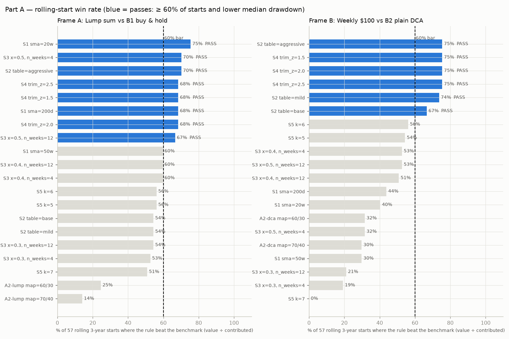
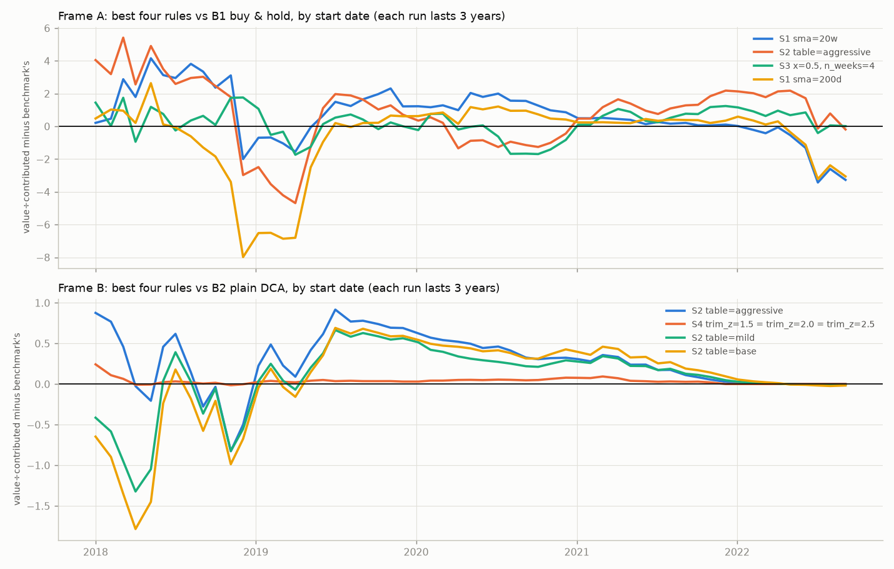
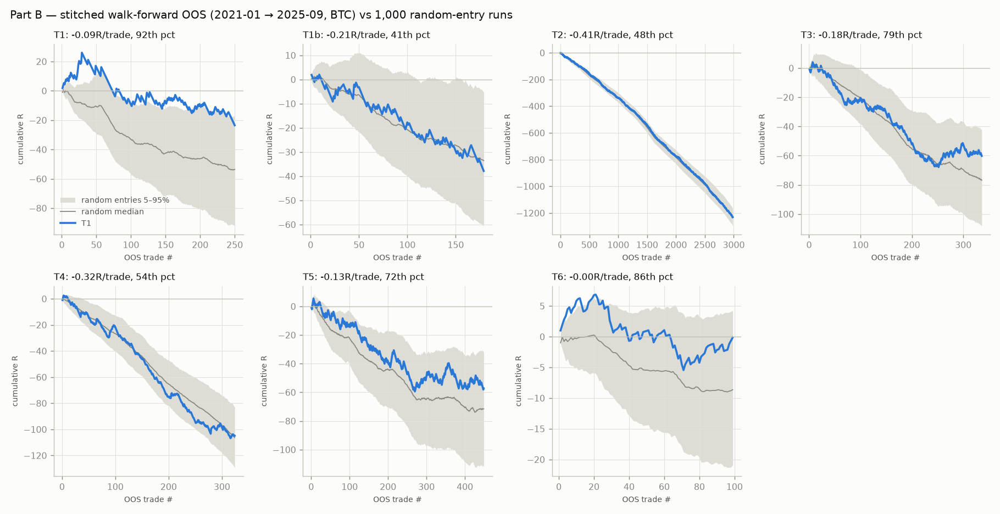

# Lab 3 — fair re-test of long-horizon rules + 6 short-term halal setups

## Verdict

**Part A — the fair re-test changes Lab 2's answer for some long-horizon rules; Part B — none of the short-term setups has an edge after costs.** Over 57 rolling 3-year starts, 8 of 20 rule settings beat lump-sum buy & hold in ≥ 60% of starts with a lower median drawdown (best: S1 sma=20w, 75% of starts, median max drawdown 46% vs 72%), and 6 beat plain weekly DCA (best: S2 table=aggressive, 75% of starts, median gain +0.31× of contributions, median drawdown 56% vs 73%). At 2× costs 8 (lump sum) and 6 (weekly) still pass. The by-start chart shows why Lab 2 said no: starting near a cycle bottom (late 2018, mid/late 2022) is exactly when these rules lose to buy & hold, and Lab 2's only out-of-sample window began at the 2022–23 bottom. The weekly-DCA edges (S2, S4) come from 2018–2021 starts and fade to about zero for 2022 starts. Treat these wins with care: the 57 windows overlap heavily (about 2.6 independent 3-year periods in 2018–2025), so the win rates rest on two or three market cycles, not 57 independent tests. The new graded market gate (A2) failed in both frames (best: 32% of starts). In Part B, every setup lost money in walk-forward OOS on BTC after costs (from -0.413R to -0.001R per trade); before costs 5 of 7 showed only a small edge (at most +0.09R), which the 0.30% round trip erases, worst for tight-stop setups such as the 1-minute T2. Nothing passed, so the holdout could not rescue anything; the holdout was negative or empty for every setup.

## Ranking — Part A (rolling 3-year starts, by % of starts won)

57 starts (first Monday of each month, 2018-01 → 2022-09), each run 3 years, all ending by 2025-09-30. **Pass = beats the benchmark on final value ÷ money contributed in ≥ 60% of starts AND has a lower median max drawdown.** Lab 2's parameter grids are used unchanged; every grid member is shown (nothing selected).

### Frame A — lump sum $10,000 vs B1 buy & hold

| Rule | Params | Starts won | Median Δ value÷contrib. | Worst Δ | Starts with lower DD | Median max DD (rule vs bench) | Median BTC per $ vs bench | Verdict | At 2× costs |
|---|---|---|---|---|---|---|---|---|---|
| **S1** BTC regime filter | `sma=20w` | 75% | +0.51 | -3.43 | 95% | 46% vs 72% | 1.01× | ✅ PASS | 74% ✅ PASS |
| **S2** DCA vs 200-week SMA | `table=aggressive` | 70% | +1.11 | -4.69 | 100% | 44% vs 72% | 0.89× | ✅ PASS | 70% ✅ PASS |
| **S3** Drawdown-from-ATH DCA | `x=0.5, n_weeks=4` | 70% | +0.33 | -1.74 | 72% | 63% vs 72% | 1.10× | ✅ PASS | 70% ✅ PASS |
| **S1** BTC regime filter | `sma=200d` | 68% | +0.24 | -7.98 | 95% | 56% vs 72% | 0.86× | ✅ PASS | 68% ✅ PASS |
| **S4** Log-regression band | `trim_z=1.5` | 68% | +0.44 | -2.17 | 77% | 63% vs 72% | 1.17× | ✅ PASS | 68% ✅ PASS |
| **S4** Log-regression band | `trim_z=2.0` | 68% | +0.44 | -2.17 | 77% | 63% vs 72% | 1.17× | ✅ PASS | 68% ✅ PASS |
| **S4** Log-regression band | `trim_z=2.5` | 68% | +0.44 | -2.17 | 77% | 63% vs 72% | 1.17× | ✅ PASS | 68% ✅ PASS |
| **S3** Drawdown-from-ATH DCA | `x=0.5, n_weeks=12` | 67% | +0.61 | -3.79 | 88% | 63% vs 72% | 1.17× | ✅ PASS | 67% ✅ PASS |
| **S1** BTC regime filter | `sma=50w` | 60% | +0.24 | -8.39 | 100% | 51% vs 72% | 0.71× | ❌ FAIL | 54% ❌ FAIL |
| **S3** Drawdown-from-ATH DCA | `x=0.4, n_weeks=4` | 60% | +0.06 | -1.74 | 53% | 67% vs 72% | 1.01× | ❌ FAIL | 60% ❌ FAIL |
| **S3** Drawdown-from-ATH DCA | `x=0.4, n_weeks=12` | 60% | +0.35 | -3.79 | 79% | 63% vs 72% | 1.08× | ❌ FAIL | 60% ❌ FAIL |
| **S5** MVRV-Z DCA | `k=5` | 56% | +0.17 | -6.37 | 100% | 54% vs 72% | 0.70× | ❌ FAIL | 56% ❌ FAIL |
| **S5** MVRV-Z DCA | `k=6` | 56% | +0.37 | -6.20 | 100% | 57% vs 72% | 0.78× | ❌ FAIL | 56% ❌ FAIL |
| **S2** DCA vs 200-week SMA | `table=mild` | 54% | +0.25 | -6.55 | 100% | 43% vs 72% | 0.67× | ❌ FAIL | 53% ❌ FAIL |
| **S2** DCA vs 200-week SMA | `table=base` | 54% | +0.33 | -6.68 | 100% | 39% vs 72% | 0.72× | ❌ FAIL | 54% ❌ FAIL |
| **S3** Drawdown-from-ATH DCA | `x=0.3, n_weeks=12` | 54% | +0.09 | -3.79 | 61% | 67% vs 72% | 1.04× | ❌ FAIL | 54% ❌ FAIL |
| **S3** Drawdown-from-ATH DCA | `x=0.3, n_weeks=4` | 53% | +0.01 | -1.74 | 51% | 67% vs 72% | 1.00× | ❌ FAIL | 53% ❌ FAIL |
| **S5** MVRV-Z DCA | `k=7` | 51% | +0.00 | -6.28 | 98% | 59% vs 72% | 1.00× | ❌ FAIL | 51% ❌ FAIL |
| **A2-lump** Market gate, lump sum | `map=60/30` | 25% | -0.51 | -6.23 | 100% | 56% vs 72% | 0.58× | ❌ FAIL | 25% ❌ FAIL |
| **A2-lump** Market gate, lump sum | `map=70/40` | 14% | -1.44 | -10.42 | 100% | 46% vs 72% | 0.24× | ❌ FAIL | 14% ❌ FAIL |

### Frame B — $100 every Monday vs B2 plain weekly DCA

| Rule | Params | Starts won | Median Δ value÷contrib. | Worst Δ | Starts with lower DD | Median max DD (rule vs bench) | Median BTC per $ vs bench | Verdict | At 2× costs |
|---|---|---|---|---|---|---|---|---|---|
| **S2** DCA vs 200-week SMA | `table=aggressive` | 75% | +0.31 | -0.83 | 86% | 56% vs 73% | 1.00× | ✅ PASS | 75% ✅ PASS |
| **S4** Log-regression band | `trim_z=1.5` | 75% | +0.03 | -0.01 | 56% | 70% vs 73% | 1.02× | ✅ PASS | 75% ✅ PASS |
| **S4** Log-regression band | `trim_z=2.0` | 75% | +0.03 | -0.01 | 56% | 70% vs 73% | 1.02× | ✅ PASS | 75% ✅ PASS |
| **S4** Log-regression band | `trim_z=2.5` | 75% | +0.03 | -0.01 | 56% | 70% vs 73% | 1.02× | ✅ PASS | 75% ✅ PASS |
| **S2** DCA vs 200-week SMA | `table=mild` | 74% | +0.19 | -1.32 | 91% | 56% vs 73% | 0.97× | ✅ PASS | 74% ✅ PASS |
| **S2** DCA vs 200-week SMA | `table=base` | 67% | +0.19 | -1.78 | 91% | 50% vs 73% | 0.97× | ✅ PASS | 67% ✅ PASS |
| **S5** MVRV-Z DCA | `k=6` | 56% | +0.03 | -0.56 | 37% | 63% vs 73% | 1.00× | ❌ FAIL | 56% ❌ FAIL |
| **S5** MVRV-Z DCA | `k=5` | 54% | +0.01 | -0.93 | 40% | 63% vs 73% | 0.99× | ❌ FAIL | 54% ❌ FAIL |
| **S3** Drawdown-from-ATH DCA | `x=0.4, n_weeks=4` | 53% | +0.00 | -0.36 | 88% | 67% vs 73% | 0.98× | ❌ FAIL | 53% ❌ FAIL |
| **S3** Drawdown-from-ATH DCA | `x=0.5, n_weeks=12` | 53% | +0.06 | -0.46 | 93% | 54% vs 73% | 0.93× | ❌ FAIL | 53% ❌ FAIL |
| **S3** Drawdown-from-ATH DCA | `x=0.4, n_weeks=12` | 51% | +0.01 | -0.36 | 88% | 64% vs 73% | 0.96× | ❌ FAIL | 51% ❌ FAIL |
| **S1** BTC regime filter | `sma=200d` | 44% | -0.50 | -3.14 | 95% | 56% vs 73% | 0.58× | ❌ FAIL | 44% ❌ FAIL |
| **S1** BTC regime filter | `sma=20w` | 40% | -0.09 | -1.31 | 95% | 46% vs 73% | 0.67× | ❌ FAIL | 39% ❌ FAIL |
| **S3** Drawdown-from-ATH DCA | `x=0.5, n_weeks=4` | 32% | -0.05 | -0.44 | 93% | 59% vs 73% | 0.94× | ❌ FAIL | 32% ❌ FAIL |
| **A2-dca** Market gate, weekly DCA | `map=60/30` | 32% | -0.02 | -0.10 | 100% | 72% vs 73% | 0.99× | ❌ FAIL | 32% ❌ FAIL |
| **S1** BTC regime filter | `sma=50w` | 30% | -0.15 | -2.80 | 100% | 51% vs 73% | 0.88× | ❌ FAIL | 30% ❌ FAIL |
| **A2-dca** Market gate, weekly DCA | `map=70/40` | 30% | -0.02 | -0.34 | 100% | 62% vs 73% | 0.97× | ❌ FAIL | 30% ❌ FAIL |
| **S3** Drawdown-from-ATH DCA | `x=0.3, n_weeks=12` | 21% | -0.00 | -0.26 | 56% | 69% vs 73% | 0.99× | ❌ FAIL | 21% ❌ FAIL |
| **S3** Drawdown-from-ATH DCA | `x=0.3, n_weeks=4` | 19% | -0.00 | -0.26 | 56% | 70% vs 73% | 0.99× | ❌ FAIL | 19% ❌ FAIL |
| **S5** MVRV-Z DCA | `k=7` | 0% | +0.00 | +0.00 | 0% | 73% vs 73% | 1.00× | ❌ FAIL | 0% ❌ FAIL |

## Ranking — Part B (stitched walk-forward OOS on BTC, by expectancy)

Walk-forward 2020-01 → 2025-09: train 12 months / test 3 months, rolling; parameters chosen in each train window by expectancy in R (≥ 30 train trades). OOS = the 19 stitched test quarters 2021-01 → 2025-09. The holdout (2025-10 → 2026-09) was run once, after `reports/lab3_frozen.json` was committed.

| Setup | Rules kept | OOS trades | Expectancy | PF | vs random | DSR | ETH | 2× costs | Months up | Holdout (trades) | Verdict |
|---|---|---|---|---|---|---|---|---|---|---|---|
| **T6** Base-crack tranche buying (QFL) | `bare trigger` | 99 | -0.001R | 1.00 | 86th | 0.00 | -0.071R | -0.036R | 50.0% | – (0) | ❌ FAIL |
| **T1** Range reclaim (liquidity sweep) | `touches, width` | 250 | -0.094R | 0.87 | 92nd | 0.00 | +0.014R | -0.204R | 47.3% | -0.335R (120) | ❌ FAIL |
| **T5** EMA200 + RSI + bullish engulfing | `bare trigger` | 449 | -0.127R | 0.81 | 72nd | 0.00 | -0.113R | -0.228R | 33.3% | -0.373R (86) | ❌ FAIL |
| **T3** Trendline break + two green candles | `trend, two_green` | 336 | -0.179R | 0.72 | 79th | 0.00 | -0.171R | -0.321R | 37.5% | -0.422R (38) | ❌ FAIL |
| **T1b** Fractal-low reclaim | `bare trigger` | 179 | -0.211R | 0.69 | 41st | 0.00 | -0.044R | -0.308R | 32.1% | -0.097R (43) | ❌ FAIL |
| **T4** Market structure + demand zone + RR filter | `bare trigger` | 324 | -0.324R | 0.43 | 54th | 0.00 | -0.246R | -0.469R | 26.3% | -0.400R (81) | ❌ FAIL |
| **T2** Volume + body expansion breakout (5m/1m) | `body, trend` | 2983 | -0.413R | 0.31 | 48th | 0.00 | -0.330R | -0.567R | 0.0% | -0.455R (623) | ❌ FAIL |

## Part A details

- Frames, rules and costs reuse Lab 2's simulator unchanged: fills at the Monday open after a Sunday-close signal, 0.10% fee + 0.05% slippage per fill (2× = 0.20% + 0.10%), 0% on cash, no leverage, no shorting.
- Frame A: $10,000 at the start, compared with B1 (all-in at the first open). Frame B: $100 every Monday, compared with B2 (buy $100 every Monday). 'Beats' = higher final value ÷ money contributed at the end of the 3-year run. Drawdown = max drawdown of the time-weighted return index (contributions removed).
- BTC per $: median over starts of (rule's BTC per $ contributed ÷ benchmark's). Below 1× means the rule ended with less BTC (it held cash or sold).
- S4's three trim levels are identical in every start: its z-score never exceeded +1.5σ inside any 2018–2025 window, so no trim fired. S5 with K = 7 in frame B is identical to plain DCA for the same reason (its ×2 is funded only by trim proceeds).
- A2 market gate: score = mean of four expanding-window percentiles (trend = close ÷ 200-day SMA; value = 100 − MVRV-Z percentile; drawdown = % below the all-time high; calm = 100 − 30-day realised volatility percentile), each ranked only against its own history up to that day (≥ 365 observations; price history from 2010 via CoinMetrics). Lump-sum mode holds 0 / 60 / 100% BTC per the map, rebalanced on Mondays only when off-target by ≥ 5% of equity. DCA mode spends exposure × ($100 + ¼ of the saved reserve) each week and never sells.
- Overlap warning: consecutive starts share 35 of 36 months, so neighbouring results are nearly the same experiment. A rule that wins 60% of starts may be winning one or two good stretches.

## Part B — per setup

Deflated Sharpe uses **229 configurations** (every setup × rule variant × parameter set evaluated in the ablation, plus the 40 Part A rule/frame configurations) and the variance of per-trade Sharpe across them (0.0715).

### T1 — Range reclaim (liquidity sweep)

Range over the last L bars (H, Lo); a sweep below Lo - 0.1 ATR reclaimed by a close above Lo within 3 bars -> buy next open. Stop = sweep low - 0.1 ATR; target H or 2R; time stop 2L bars.

Grid (12 sets): `{'tf': ['1h', '4h', '1d'], 'L': [30, 60], 'target': ['H', '2R']}` · rules as specified: `['time_stop', 'touches', 'trend', 'width']` · rules kept by the ablation: `['touches', 'width']`

**Ablation ladder** (OOS expectancy after each step; a rule is kept only if it improves it)

| Step | Rules | OOS trades | OOS expectancy | Kept |
|---|---|---|---|---|
| bare trigger | `–` | 282 | -0.156R | ✅ |
| + touches | `touches` | 251 | -0.098R | ✅ |
| + width | `touches, width` | 250 | -0.094R | ✅ |
| + trend | `touches, width, trend` | 232 | -0.120R | – |
| + time_stop | `touches, width, time_stop` | 274 | -0.194R | – |

| Run | Period | Trades | Win | Avg win | Avg loss | Expectancy | PF | CAGR | Max DD | Exposure | Months up | Lose streak | …days |
|---|---|---|---|---|---|---|---|---|---|---|---|---|---|
| Walk-forward OOS (BTC) | 2021-01→2025-09 | 250 | 29.6% | 2.06 | -1.00 | -0.094R | 0.87 | -7.1% | 49.5% | 38.1% | 47.3% | 20 | 78 |
| In-sample (train windows, chosen sets) | 2020→2025 | 947 | 34.0% | 2.18 | -1.00 | +0.081R | 1.12 | 19.4% | 66.7% | 117.8% | 56.2% | 30 | 11 |
| ETH, BTC-chosen parameters |  | 232 | 31.5% | 2.22 | -1.00 | +0.014R | 1.02 | 0.3% | 36.7% | 40.9% | 48.1% | 24 | 96 |
| 2× costs |  | 250 | 29.6% | 1.69 | -1.00 | -0.204R | 0.71 | -15.3% | 65.3% | 38.1% | 43.6% | 20 | 78 |
| 0 costs (diagnostic only) |  | 250 | 29.6% | 2.62 | -1.00 | +0.072R | 1.10 | 4.3% | 34.4% | 38.1% | 58.2% | 20 | 78 |
| Rules as specified (BTC OOS) |  | 216 | 33.8% | 1.69 | -0.99 | -0.085R | 0.87 | -4.0% | 36.8% | 18.0% | 38.2% | 11 | 7 |
| **Holdout** (BTC, frozen rules) | 2025-10→2026-09 | 120 | 30.0% | 1.22 | -1.00 | -0.335R | 0.52 | -34.3% | 36.0% | 17.4% | 25.0% | 9 | 23 |

- Random-entry baseline: setup expectancy is at the **92nd percentile** of 1,000 runs (median random -0.214R).
- Deflated Sharpe: **0.00** · IS→OOS degradation ratio (OOS ÷ mean train expectancy): -0.68
- BTC buy & hold over the same OOS span: +289% (+33% a year).
- Chosen per test quarter: `{'tf': '4h', 'L': 60, 'target': '2R'}`, `{'tf': '4h', 'L': 30, 'target': 'H'}`, `{'tf': '4h', 'L': 30, 'target': 'H'}`, `{'tf': '4h', 'L': 30, 'target': 'H'}`, `{'tf': '4h', 'L': 30, 'target': 'H'}`, `{'tf': '4h', 'L': 30, 'target': 'H'}`, `{'tf': '4h', 'L': 30, 'target': '2R'}`, `{'tf': '4h', 'L': 30, 'target': '2R'}`, `{'tf': '4h', 'L': 30, 'target': 'H'}`, `{'tf': '4h', 'L': 30, 'target': 'H'}`, `{'tf': '4h', 'L': 30, 'target': 'H'}`, `{'tf': '4h', 'L': 30, 'target': '2R'}`, `{'tf': '4h', 'L': 30, 'target': '2R'}`, `{'tf': '4h', 'L': 30, 'target': '2R'}`, `{'tf': '4h', 'L': 30, 'target': '2R'}`, `{'tf': '4h', 'L': 30, 'target': '2R'}`, `{'tf': '4h', 'L': 30, 'target': '2R'}`, `{'tf': '4h', 'L': 30, 'target': '2R'}`, `{'tf': '4h', 'L': 30, 'target': '2R'}`
- Holdout choices: `{'tf': '4h', 'L': 30, 'target': '2R'}`, `{'tf': '1h', 'L': 60, 'target': '2R'}`, `{'tf': '4h', 'L': 30, 'target': '2R'}`, `{'tf': '1h', 'L': 60, 'target': '2R'}`

**Pass checks**

| Rule | Result | Value |
|---|---|---|
| OOS expectancy > 0.10R | ❌ | -0.094R |
| profit factor > 1.2 | ❌ | 0.87 |
| ≥ 100 OOS trades | ✅ | 250 |
| above 95th pct of random entries | ❌ | 92th |
| Deflated Sharpe > 0.95 | ❌ | 0.00 |
| ETH cross-check expectancy > 0 | ✅ | +0.014R (232 tr) |
| positive at 2x costs | ❌ | -0.204R |
| ≥ 60% profitable months | ❌ | 47% |
| holdout expectancy > 0 | ❌ | -0.335R (120 trades) |

Verdict: **❌ FAIL**

### T1b — Fractal-low reclaim

T1 with Lo = the most recent confirmed fractal swing low (k=5) and H = the most recent confirmed fractal swing high; each swing low is used once. Time stop 120 bars.

Grid (6 sets): `{'tf': ['1h', '4h', '1d'], 'target': ['H', '2R']}` · rules as specified: `['time_stop', 'trend']` · rules kept by the ablation: `none (bare trigger)`

**Ablation ladder** (OOS expectancy after each step; a rule is kept only if it improves it)

| Step | Rules | OOS trades | OOS expectancy | Kept |
|---|---|---|---|---|
| bare trigger | `–` | 179 | -0.211R | ✅ |
| + trend | `trend` | 353 | -0.335R | – |
| + time_stop | `time_stop` | 178 | -0.235R | – |

| Run | Period | Trades | Win | Avg win | Avg loss | Expectancy | PF | CAGR | Max DD | Exposure | Months up | Lose streak | …days |
|---|---|---|---|---|---|---|---|---|---|---|---|---|---|
| Walk-forward OOS (BTC) | 2021-01→2025-09 | 179 | 31.3% | 1.50 | -0.99 | -0.211R | 0.69 | -9.1% | 38.1% | 17.4% | 32.1% | 8 | 26 |
| In-sample (train windows, chosen sets) | 2020→2025 | 687 | 37.0% | 1.63 | -1.00 | -0.024R | 0.96 | -0.7% | 63.7% | 58.0% | 50.8% | 32 | 26 |
| ETH, BTC-chosen parameters |  | 165 | 37.6% | 1.54 | -1.00 | -0.044R | 0.93 | -1.4% | 27.7% | 19.2% | 48.1% | 6 | 66 |
| 2× costs |  | 179 | 31.3% | 1.20 | -0.99 | -0.308R | 0.55 | -15.2% | 55.6% | 17.4% | 28.6% | 8 | 26 |
| 0 costs (diagnostic only) |  | 179 | 31.8% | 1.92 | -1.00 | -0.069R | 0.90 | -1.4% | 15.8% | 17.4% | 41.1% | 8 | 26 |
| Rules as specified (BTC OOS) |  | 367 | 31.6% | 1.22 | -0.98 | -0.284R | 0.58 | -18.7% | 63.1% | 10.6% | 31.6% | 10 | 16 |
| **Holdout** (BTC, frozen rules) | 2025-10→2026-09 | 43 | 32.6% | 1.77 | -1.00 | -0.097R | 0.86 | -6.4% | 10.2% | 11.6% | 41.7% | 6 | 30 |

- Random-entry baseline: setup expectancy is at the **41st percentile** of 1,000 runs (median random -0.187R).
- Deflated Sharpe: **0.00** · IS→OOS degradation ratio (OOS ÷ mean train expectancy): –
- BTC buy & hold over the same OOS span: +289% (+33% a year).
- Chosen per test quarter: `{'tf': '4h', 'target': '2R'}`, `{'tf': '4h', 'target': '2R'}`, `{'tf': '4h', 'target': 'H'}`, `{'tf': '4h', 'target': 'H'}`, `{'tf': '4h', 'target': 'H'}`, `{'tf': '4h', 'target': '2R'}`, `{'tf': '4h', 'target': '2R'}`, `{'tf': '4h', 'target': '2R'}`, `{'tf': '4h', 'target': '2R'}`, `{'tf': '4h', 'target': '2R'}`, `{'tf': '4h', 'target': 'H'}`, `{'tf': '4h', 'target': '2R'}`, `{'tf': '4h', 'target': '2R'}`, `{'tf': '4h', 'target': '2R'}`, `{'tf': '4h', 'target': 'H'}`, `{'tf': '4h', 'target': 'H'}`, `{'tf': '4h', 'target': 'H'}`, `{'tf': '4h', 'target': '2R'}`, `{'tf': '4h', 'target': '2R'}`
- Holdout choices: `{'tf': '4h', 'target': '2R'}`, `{'tf': '4h', 'target': '2R'}`, `{'tf': '4h', 'target': 'H'}`, `{'tf': '4h', 'target': 'H'}`

**Pass checks**

| Rule | Result | Value |
|---|---|---|
| OOS expectancy > 0.10R | ❌ | -0.211R |
| profit factor > 1.2 | ❌ | 0.69 |
| ≥ 100 OOS trades | ✅ | 179 |
| above 95th pct of random entries | ❌ | 41th |
| Deflated Sharpe > 0.95 | ❌ | 0.00 |
| ETH cross-check expectancy > 0 | ❌ | -0.044R (165 tr) |
| positive at 2x costs | ❌ | -0.308R |
| ≥ 60% profitable months | ❌ | 32% |
| holdout expectancy > 0 | ❌ | -0.097R (43 trades) |

Verdict: **❌ FAIL**

### T2 — Volume + body expansion breakout (5m/1m)

5m green candle with volume and body >= m x their previous-10 averages; level = its high. On 1m: first candle closing above the level within 60 minutes -> buy next 1m open (or a retest limit at the level valid 30 minutes). Stop = signal low; target 1R/2R.

Grid (8 sets): `{'m': [1.5, 2.0], 'entry': ['immediate', 'retest'], 'target_r': [1.0, 2.0]}` · rules as specified: `['body', 'trend']` · rules kept by the ablation: `['body', 'trend']`

**Ablation ladder** (OOS expectancy after each step; a rule is kept only if it improves it)

| Step | Rules | OOS trades | OOS expectancy | Kept |
|---|---|---|---|---|
| bare trigger | `–` | 4584 | -0.491R | ✅ |
| + body | `body` | 3600 | -0.426R | ✅ |
| + trend | `body, trend` | 2983 | -0.413R | ✅ |

| Run | Period | Trades | Win | Avg win | Avg loss | Expectancy | PF | CAGR | Max DD | Exposure | Months up | Lose streak | …days |
|---|---|---|---|---|---|---|---|---|---|---|---|---|---|
| Walk-forward OOS (BTC) | 2021-04→2025-09 | 2983 | 36.5% | 0.50 | -0.94 | -0.413R | 0.31 | -85.2% | 100.0% | 17.3% | 0.0% | 30 | 25 |
| In-sample (train windows, chosen sets) | 2020→2025 | 10851 | 38.4% | 0.55 | -0.96 | -0.378R | 0.36 | -99.5% | 100.0% | 52.8% | 0.0% | 68 | 13 |
| ETH, BTC-chosen parameters |  | 3148 | 39.5% | 0.62 | -0.95 | -0.330R | 0.43 | -83.7% | 100.0% | 18.2% | 1.9% | 27 | 13 |
| 2× costs |  | 2983 | 22.0% | 0.31 | -0.81 | -0.567R | 0.11 | -97.8% | 100.0% | 17.3% | 0.0% | 32 | 13 |
| 0 costs (diagnostic only) |  | 2983 | 41.7% | 1.42 | -1.00 | +0.010R | 1.02 | 5.1% | 24.0% | 17.3% | 57.4% | 15 | 4 |
| Rules as specified (BTC OOS) |  | 2983 | 36.5% | 0.50 | -0.94 | -0.413R | 0.31 | -85.2% | 100.0% | 17.3% | 0.0% | 30 | 25 |
| **Holdout** (BTC, frozen rules) | 2025-10→2026-09 | 623 | 30.3% | 0.63 | -0.93 | -0.455R | 0.30 | -83.6% | 83.5% | 21.3% | 0.0% | 18 | 11 |

- Random-entry baseline: setup expectancy is at the **48th percentile** of 1,000 runs (median random -0.412R).
- Deflated Sharpe: **0.00** · IS→OOS degradation ratio (OOS ÷ mean train expectancy): –
- BTC buy & hold over the same OOS span: +94% (+16% a year).
- Chosen per test quarter: `–`, `{'m': 2.0, 'entry': 'retest', 'target_r': 1.0}`, `{'m': 2.0, 'entry': 'immediate', 'target_r': 1.0}`, `{'m': 2.0, 'entry': 'immediate', 'target_r': 1.0}`, `{'m': 2.0, 'entry': 'immediate', 'target_r': 1.0}`, `{'m': 2.0, 'entry': 'immediate', 'target_r': 1.0}`, `{'m': 2.0, 'entry': 'immediate', 'target_r': 1.0}`, `{'m': 2.0, 'entry': 'immediate', 'target_r': 1.0}`, `{'m': 2.0, 'entry': 'retest', 'target_r': 1.0}`, `{'m': 2.0, 'entry': 'immediate', 'target_r': 1.0}`, `{'m': 2.0, 'entry': 'immediate', 'target_r': 2.0}`, `{'m': 2.0, 'entry': 'immediate', 'target_r': 2.0}`, `{'m': 2.0, 'entry': 'immediate', 'target_r': 2.0}`, `{'m': 2.0, 'entry': 'immediate', 'target_r': 2.0}`, `{'m': 2.0, 'entry': 'immediate', 'target_r': 2.0}`, `{'m': 2.0, 'entry': 'immediate', 'target_r': 2.0}`, `{'m': 2.0, 'entry': 'immediate', 'target_r': 2.0}`, `{'m': 2.0, 'entry': 'immediate', 'target_r': 2.0}`, `{'m': 2.0, 'entry': 'immediate', 'target_r': 2.0}`
- Holdout choices: `{'m': 2.0, 'entry': 'immediate', 'target_r': 2.0}`, `{'m': 2.0, 'entry': 'immediate', 'target_r': 1.0}`, `{'m': 2.0, 'entry': 'immediate', 'target_r': 2.0}`, `{'m': 2.0, 'entry': 'immediate', 'target_r': 2.0}`

**Pass checks**

| Rule | Result | Value |
|---|---|---|
| OOS expectancy > 0.10R | ❌ | -0.413R |
| profit factor > 1.2 | ❌ | 0.31 |
| ≥ 100 OOS trades | ✅ | 2983 |
| above 95th pct of random entries | ❌ | 48th |
| Deflated Sharpe > 0.95 | ❌ | 0.00 |
| ETH cross-check expectancy > 0 | ❌ | -0.330R (3148 tr) |
| positive at 2x costs | ❌ | -0.567R |
| ≥ 60% profitable months | ❌ | 0% |
| holdout expectancy > 0 | ❌ | -0.455R (623 trades) |

Verdict: **❌ FAIL**

### T3 — Trendline break + two green candles

In a pullback, a line through the last two confirmed descending fractal highs; a green close above it followed by another green candle -> buy next open. Stop = lowest low since the second pivot; target 2R.

Grid (6 sets): `{'tf': ['15m', '1h', '4h'], 'k': [3, 5]}` · rules as specified: `['trend', 'two_green']` · rules kept by the ablation: `['trend', 'two_green']`

**Ablation ladder** (OOS expectancy after each step; a rule is kept only if it improves it)

| Step | Rules | OOS trades | OOS expectancy | Kept |
|---|---|---|---|---|
| bare trigger | `–` | 503 | -0.238R | ✅ |
| + two_green | `two_green` | 710 | -0.182R | ✅ |
| + trend | `two_green, trend` | 336 | -0.179R | ✅ |

| Run | Period | Trades | Win | Avg win | Avg loss | Expectancy | PF | CAGR | Max DD | Exposure | Months up | Lose streak | …days |
|---|---|---|---|---|---|---|---|---|---|---|---|---|---|
| Walk-forward OOS (BTC) | 2021-01→2025-09 | 336 | 35.7% | 1.28 | -0.99 | -0.179R | 0.72 | -13.3% | 58.4% | 20.6% | 37.5% | 8 | 23 |
| In-sample (train windows, chosen sets) | 2020→2025 | 1399 | 40.8% | 1.36 | -1.00 | -0.035R | 0.94 | -6.5% | 87.8% | 68.3% | 53.8% | 32 | 23 |
| ETH, BTC-chosen parameters |  | 346 | 33.5% | 1.47 | -1.00 | -0.171R | 0.74 | -14.3% | 62.7% | 20.5% | 33.9% | 9 | 24 |
| 2× costs |  | 336 | 33.6% | 0.95 | -0.97 | -0.321R | 0.50 | -25.9% | 77.0% | 20.6% | 26.8% | 10 | 20 |
| 0 costs (diagnostic only) |  | 336 | 36.3% | 2.00 | -1.00 | +0.089R | 1.14 | 3.5% | 25.4% | 20.6% | 55.4% | 8 | 23 |
| Rules as specified (BTC OOS) |  | 336 | 35.7% | 1.28 | -0.99 | -0.179R | 0.72 | -13.3% | 58.4% | 20.6% | 37.5% | 8 | 23 |
| **Holdout** (BTC, frozen rules) | 2025-10→2026-09 | 38 | 26.3% | 1.19 | -1.00 | -0.422R | 0.43 | -17.9% | 20.4% | 18.2% | 27.3% | 10 | 75 |

- Random-entry baseline: setup expectancy is at the **79th percentile** of 1,000 runs (median random -0.229R).
- Deflated Sharpe: **0.00** · IS→OOS degradation ratio (OOS ÷ mean train expectancy): -6.61
- BTC buy & hold over the same OOS span: +289% (+33% a year).
- Chosen per test quarter: `{'tf': '1h', 'k': 5}`, `{'tf': '1h', 'k': 5}`, `{'tf': '1h', 'k': 5}`, `{'tf': '15m', 'k': 5}`, `{'tf': '15m', 'k': 5}`, `{'tf': '15m', 'k': 5}`, `{'tf': '15m', 'k': 5}`, `{'tf': '15m', 'k': 5}`, `{'tf': '15m', 'k': 5}`, `{'tf': '1h', 'k': 3}`, `{'tf': '1h', 'k': 3}`, `{'tf': '1h', 'k': 3}`, `{'tf': '1h', 'k': 5}`, `{'tf': '1h', 'k': 3}`, `{'tf': '1h', 'k': 5}`, `{'tf': '1h', 'k': 5}`, `{'tf': '1h', 'k': 3}`, `{'tf': '1h', 'k': 3}`, `{'tf': '1h', 'k': 5}`
- Holdout choices: `{'tf': '1h', 'k': 3}`, `{'tf': '1h', 'k': 5}`, `{'tf': '1h', 'k': 5}`, `{'tf': '1h', 'k': 3}`

**Pass checks**

| Rule | Result | Value |
|---|---|---|
| OOS expectancy > 0.10R | ❌ | -0.179R |
| profit factor > 1.2 | ❌ | 0.72 |
| ≥ 100 OOS trades | ✅ | 336 |
| above 95th pct of random entries | ❌ | 79th |
| Deflated Sharpe > 0.95 | ❌ | 0.00 |
| ETH cross-check expectancy > 0 | ❌ | -0.171R (346 tr) |
| positive at 2x costs | ❌ | -0.321R |
| ≥ 60% profitable months | ❌ | 38% |
| holdout expectancy > 0 | ❌ | -0.422R (38 trades) |

Verdict: **❌ FAIL**

### T4 — Market structure + demand zone + RR filter

Structure uptrend (a swing low is valid once price closes above the prior swing high; the trend is up while the latest valid low holds), demand zone = last candle before an impulse (body >= 2 ATR or 3-bar move >= 3 ATR) that follows a tight 5-bar consolidation (<= 1.5 ATR). Limit buy at the zone high, stop 0.1 ATR below the zone low, target = latest swing high, only if reward/risk >= 2.5. Pivots: fractal k=3.

Grid (3 sets): `{'tf': ['1h', '4h', '1d']}` · rules as specified: `['consolidation', 'rr', 'structure']` · rules kept by the ablation: `none (bare trigger)`

**Ablation ladder** (OOS expectancy after each step; a rule is kept only if it improves it)

| Step | Rules | OOS trades | OOS expectancy | Kept |
|---|---|---|---|---|
| bare trigger | `–` | 324 | -0.324R | ✅ |
| + consolidation | `consolidation` | 0 | – | – |
| + structure | `structure` | 300 | -0.371R | – |
| + rr | `rr` | 0 | – | – |

| Run | Period | Trades | Win | Avg win | Avg loss | Expectancy | PF | CAGR | Max DD | Exposure | Months up | Lose streak | …days |
|---|---|---|---|---|---|---|---|---|---|---|---|---|---|
| Walk-forward OOS (BTC) | 2021-01→2025-09 | 324 | 35.8% | 0.70 | -0.89 | -0.324R | 0.43 | -14.9% | 56.7% | 2.8% | 26.3% | 13 | 40 |
| In-sample (train windows, chosen sets) | 2020→2025 | 1306 | 34.8% | 0.69 | -0.90 | -0.347R | 0.41 | -46.9% | 97.8% | 9.0% | 23.9% | 52 | 40 |
| ETH, BTC-chosen parameters |  | 303 | 38.6% | 0.81 | -0.91 | -0.246R | 0.56 | -12.1% | 55.3% | 3.9% | 33.3% | 16 | 70 |
| 2× costs |  | 324 | 24.4% | 0.56 | -0.80 | -0.469R | 0.22 | -29.7% | 81.7% | 2.8% | 14.0% | 26 | 101 |
| 0 costs (diagnostic only) |  | 324 | 44.4% | 1.23 | -1.00 | -0.011R | 0.98 | 3.7% | 14.6% | 2.8% | 45.6% | 8 | 45 |
| Rules as specified (BTC OOS) |  | 0 | – | – | – | – | – | 0.0% | 0.0% | 0.0% | – | 0 | 0 |
| **Holdout** (BTC, frozen rules) | 2025-10→2026-09 | 81 | 27.2% | 0.76 | -0.83 | -0.400R | 0.34 | -23.3% | 24.1% | 3.8% | 0.0% | 12 | 25 |

- Random-entry baseline: setup expectancy is at the **54th percentile** of 1,000 runs (median random -0.328R).
- Deflated Sharpe: **0.00** · IS→OOS degradation ratio (OOS ÷ mean train expectancy): –
- BTC buy & hold over the same OOS span: +289% (+33% a year).
- Chosen per test quarter: `{'tf': '1h'}`, `{'tf': '1h'}`, `{'tf': '1h'}`, `{'tf': '1h'}`, `{'tf': '1h'}`, `{'tf': '1h'}`, `{'tf': '1h'}`, `{'tf': '1h'}`, `{'tf': '4h'}`, `{'tf': '1h'}`, `{'tf': '1h'}`, `{'tf': '1h'}`, `{'tf': '1h'}`, `{'tf': '1h'}`, `{'tf': '1h'}`, `{'tf': '1h'}`, `{'tf': '1h'}`, `{'tf': '1h'}`, `{'tf': '1h'}`
- Holdout choices: `{'tf': '1h'}`, `{'tf': '1h'}`, `{'tf': '1h'}`, `{'tf': '1h'}`

**Pass checks**

| Rule | Result | Value |
|---|---|---|
| OOS expectancy > 0.10R | ❌ | -0.324R |
| profit factor > 1.2 | ❌ | 0.43 |
| ≥ 100 OOS trades | ✅ | 324 |
| above 95th pct of random entries | ❌ | 54th |
| Deflated Sharpe > 0.95 | ❌ | 0.00 |
| ETH cross-check expectancy > 0 | ❌ | -0.246R (303 tr) |
| positive at 2x costs | ❌ | -0.469R |
| ≥ 60% profitable months | ❌ | 26% |
| holdout expectancy > 0 | ❌ | -0.400R (81 trades) |

Verdict: **❌ FAIL**

### T5 — EMA200 + RSI + bullish engulfing

Close > EMA200, RSI14 > 50, bullish engulfing candle closed -> buy next open. Stop = entry - 2 x engulfing candle range; target 2R.

Grid (3 sets): `{'tf': ['15m', '1h', '4h']}` · rules as specified: `['rsi', 'trend']` · rules kept by the ablation: `none (bare trigger)`

**Ablation ladder** (OOS expectancy after each step; a rule is kept only if it improves it)

| Step | Rules | OOS trades | OOS expectancy | Kept |
|---|---|---|---|---|
| bare trigger | `–` | 449 | -0.127R | ✅ |
| + trend | `trend` | 412 | -0.131R | – |
| + rsi | `rsi` | 528 | -0.151R | – |

| Run | Period | Trades | Win | Avg win | Avg loss | Expectancy | PF | CAGR | Max DD | Exposure | Months up | Lose streak | …days |
|---|---|---|---|---|---|---|---|---|---|---|---|---|---|
| Walk-forward OOS (BTC) | 2021-01→2025-09 | 449 | 34.1% | 1.56 | -1.00 | -0.127R | 0.81 | -14.9% | 58.1% | 85.6% | 33.3% | 10 | 13 |
| In-sample (train windows, chosen sets) | 2020→2025 | 1689 | 35.6% | 1.62 | -1.00 | -0.069R | 0.89 | -22.4% | 96.0% | 272.9% | 40.3% | 45 | 54 |
| ETH, BTC-chosen parameters |  | 532 | 33.8% | 1.62 | -1.00 | -0.113R | 0.83 | -16.9% | 66.7% | 81.0% | 36.4% | 10 | 13 |
| 2× costs |  | 449 | 34.1% | 1.27 | -1.00 | -0.228R | 0.65 | -27.2% | 79.7% | 85.6% | 27.5% | 10 | 13 |
| 0 costs (diagnostic only) |  | 449 | 34.1% | 1.99 | -1.00 | +0.020R | 1.03 | 2.9% | 33.6% | 85.6% | 47.1% | 10 | 13 |
| Rules as specified (BTC OOS) |  | 373 | 36.5% | 1.48 | -1.00 | -0.095R | 0.85 | -8.4% | 44.0% | 49.5% | 42.9% | 12 | 111 |
| **Holdout** (BTC, frozen rules) | 2025-10→2026-09 | 86 | 24.4% | 1.57 | -1.00 | -0.373R | 0.51 | -37.9% | 42.9% | 80.2% | 27.3% | 9 | 53 |

- Random-entry baseline: setup expectancy is at the **72nd percentile** of 1,000 runs (median random -0.159R).
- Deflated Sharpe: **0.00** · IS→OOS degradation ratio (OOS ÷ mean train expectancy): -9.72
- BTC buy & hold over the same OOS span: +289% (+33% a year).
- Chosen per test quarter: `{'tf': '4h'}`, `{'tf': '1h'}`, `{'tf': '1h'}`, `{'tf': '4h'}`, `{'tf': '4h'}`, `{'tf': '1h'}`, `{'tf': '1h'}`, `{'tf': '1h'}`, `{'tf': '1h'}`, `{'tf': '1h'}`, `{'tf': '1h'}`, `{'tf': '1h'}`, `{'tf': '1h'}`, `{'tf': '1h'}`, `{'tf': '4h'}`, `{'tf': '4h'}`, `{'tf': '4h'}`, `{'tf': '4h'}`, `{'tf': '4h'}`
- Holdout choices: `{'tf': '4h'}`, `{'tf': '1h'}`, `{'tf': '4h'}`, `{'tf': '4h'}`

**Pass checks**

| Rule | Result | Value |
|---|---|---|
| OOS expectancy > 0.10R | ❌ | -0.127R |
| profit factor > 1.2 | ❌ | 0.81 |
| ≥ 100 OOS trades | ✅ | 449 |
| above 95th pct of random entries | ❌ | 72th |
| Deflated Sharpe > 0.95 | ❌ | 0.00 |
| ETH cross-check expectancy > 0 | ❌ | -0.113R (532 tr) |
| positive at 2x costs | ❌ | -0.228R |
| ≥ 60% profitable months | ❌ | 33% |
| holdout expectancy > 0 | ❌ | -0.373R (86 trades) |

Verdict: **❌ FAIL**

### T6 — Base-crack tranche buying (QFL)

QFL: base = confirmed fractal swing low (k=3) followed by a bounce >= b% within 20 bars. Crack = close below base by d% -> 4 equal limit tranches at base x (1-d), (1-2d), (1-3d), (1-4d). Exit all at the base (limit); failure exit at the next open after a close below base x (1-5d), or after 30 days. Sized so the loss at the failure level (all 4 filled) = 1.5% of equity.

Grid (8 sets): `{'tf': ['1h', '4h'], 'b': [0.03, 0.05], 'd': [0.02, 0.04]}` · rules as specified: `['time30']` · rules kept by the ablation: `none (bare trigger)`

**Ablation ladder** (OOS expectancy after each step; a rule is kept only if it improves it)

| Step | Rules | OOS trades | OOS expectancy | Kept |
|---|---|---|---|---|
| bare trigger | `–` | 99 | -0.001R | ✅ |
| + time30 | `time30` | 99 | -0.001R | – |
| + trend | `trend` | 0 | – | – |

| Run | Period | Trades | Win | Avg win | Avg loss | Expectancy | PF | CAGR | Max DD | Exposure | Months up | Lose streak | …days |
|---|---|---|---|---|---|---|---|---|---|---|---|---|---|
| Walk-forward OOS (BTC) | 2021-01→2025-09 | 99 | 73.7% | 0.40 | -1.11 | -0.001R | 1.00 | -0.2% | 17.1% | 11.7% | 50.0% | 3 | 4 |
| In-sample (train windows, chosen sets) | 2020→2025 | 416 | 71.2% | 0.39 | -1.07 | -0.034R | 0.89 | -4.0% | 46.0% | 35.5% | 50.0% | 11 | 33 |
| ETH, BTC-chosen parameters |  | 152 | 71.1% | 0.39 | -1.20 | -0.071R | 0.79 | -3.6% | 24.7% | 11.2% | 51.5% | 5 | 31 |
| 2× costs |  | 99 | 73.7% | 0.35 | -1.11 | -0.036R | 0.88 | -1.2% | 18.5% | 11.7% | 50.0% | 3 | 4 |
| 0 costs (diagnostic only) |  | 99 | 73.7% | 0.45 | -1.12 | +0.037R | 1.13 | 1.0% | 15.6% | 11.7% | 50.0% | 3 | 4 |
| Rules as specified (BTC OOS) |  | 99 | 73.7% | 0.40 | -1.11 | -0.001R | 1.00 | -0.2% | 17.1% | 11.7% | 50.0% | 3 | 4 |
| **Holdout** (BTC, frozen rules) | 2025-10→2026-09 | 0 | – | – | – | – | – | 0.0% | 0.0% | 0.0% | – | 0 | 0 |

- Random-entry baseline: setup expectancy is at the **86th percentile** of 1,000 runs (median random -0.087R).
- Deflated Sharpe: **0.00** · IS→OOS degradation ratio (OOS ÷ mean train expectancy): –
- BTC buy & hold over the same OOS span: +289% (+33% a year).
- Chosen per test quarter: `{'tf': '1h', 'b': 0.03, 'd': 0.02}`, `{'tf': '1h', 'b': 0.03, 'd': 0.02}`, `{'tf': '1h', 'b': 0.03, 'd': 0.02}`, `{'tf': '1h', 'b': 0.05, 'd': 0.02}`, `{'tf': '4h', 'b': 0.05, 'd': 0.02}`, `{'tf': '4h', 'b': 0.03, 'd': 0.02}`, `{'tf': '1h', 'b': 0.05, 'd': 0.02}`, `{'tf': '1h', 'b': 0.03, 'd': 0.02}`, `{'tf': '1h', 'b': 0.03, 'd': 0.02}`, `{'tf': '1h', 'b': 0.03, 'd': 0.02}`, `–`, `–`, `–`, `–`, `–`, `–`, `–`, `{'tf': '1h', 'b': 0.03, 'd': 0.02}`, `–`
- Holdout choices: `–`, `–`, `–`, `–`

**Pass checks**

| Rule | Result | Value |
|---|---|---|
| OOS expectancy > 0.10R | ❌ | -0.001R |
| profit factor > 1.2 | ❌ | 1.00 |
| ≥ 100 OOS trades | ❌ | 99 |
| above 95th pct of random entries | ❌ | 86th |
| Deflated Sharpe > 0.95 | ❌ | 0.00 |
| ETH cross-check expectancy > 0 | ❌ | -0.071R (152 tr) |
| positive at 2x costs | ❌ | -0.036R |
| ≥ 60% profitable months | ❌ | 50% |
| holdout expectancy > 0 | ❌ | – (0 trades) |

Verdict: **❌ FAIL**

**T6 with the trend filter (close > EMA200 at the crack)** — the spec asks for it to be reported: the walk-forward never traded it, because no parameter set ever reached 30 trades in a 12-month train window (the most was 14). Diagnostic on development data (`scripts/lab3_t6_trend_counts.py`):

| tf | b | d | trades 2019–2025 | most in one 12-month train window | expectancy (whole period) |
|---|---|---|---|---|---|
| 1h | 3% | 2% | 37 | 14 | +0.164R |
| 1h | 3% | 4% | 6 | 2 | +0.106R |
| 1h | 5% | 2% | 10 | 4 | +0.320R |
| 1h | 5% | 4% | 1 | 0 | +0.291R |
| 4h | 3% | 2% | 31 | 9 | +0.260R |
| 4h | 3% | 4% | 12 | 5 | +0.276R |
| 4h | 5% | 2% | 27 | 9 | +0.255R |
| 4h | 5% | 4% | 10 | 5 | +0.318R |

All 8 of 8 parameter sets are positive here, which makes this the only lead in Part B. It is **not** evidence: these are whole-period numbers (not out-of-sample), samples are tiny (1–37 trades in 6¾ years), trades overlap across the sets, and this variant was never run on the holdout (the frozen T6 was the bare version). It would need years of forward data (or paper trading) before it could be tested fairly; it is not a paper-trading candidate under this lab's rules.

## Look-ahead tests and the holdout protocol

- `tests/test_lab3.py` (52 tests, synthetic data) for every setup, with no optional rules and with all rules: (1) append-one-bar invariance; (2) close-shock: changing one bar's close (×0.9 / ×1.1, every timeframe) leaves every earlier signal unchanged; (3) every order already exists, field for field, when the data ends exactly at its signal bar's close (catches any peek at a later bar).
- Mutation checks: a one-bar RSI peek injected into T5, and a stop computed one bar ahead in T3, were both caught by test (3). (Test (1) alone did not catch them; that weakness is why test (3) exists.)
- Static check: signal and filter code (`lab3/market.py`, `lab3/setups.py`, `lab3/partA.py`, `lab2/signals.py`, `lab/indicators.py`) may not use `filtfilt`, `center=True`, `.shift(-…)`, `bfill`, `np.roll`, reversed arrays, Savitzky-Golay/LOWESS smoothing or interpolation.
- Fractal pivots are reported only at their confirmation bar (k bars after the pivot); a test checks the pivot is absent when the data ends earlier.
- Walk-forward: a test shows the parameter choice for a test quarter is unchanged when only that quarter's data are altered. Part A gate: a test shows the score up to t is identical with or without later data.
- Holdout lock: `lab3.data.load_bars` drops everything after 2025-09-30 unless `holdout=True`. Every development-time market asserts no bar beyond 2025-09-30, and a test checks the lock.
- Frozen choices: `reports/lab3_frozen.json` (sha256 `906682460d977478…`), committed before the holdout was loaded. The holdout script refuses to run twice.

## Data gaps and assumptions

- Data: Binance spot BTCUSDT / ETHUSDT klines (1m from 2020-12, 5m/15m/1h/4h from 2019-01, 1d from 2017-08) from data.binance.vision via its S3 bucket. Part A uses Lab 2's merged daily data and the free CoinMetrics file (MVRV-Z from market cap ÷ MVRV, published-day lag), all cut at 2025-09-30.
- Holdout honesty: the 2025-10 → 2026-09 period had been seen in Lab 2's report (as part of its 2023–26 out-of-sample window) but no Lab 3 setup, rule or parameter was ever run or inspected on it before the frozen file was committed. Part A does not use the holdout (all 3-year runs end by 2025-09-30).
- Ablation uses OOS results to decide which rules to keep, as requested. That is a form of selection on the test data, so the OOS numbers of the kept variant are slightly optimistic. The Deflated Sharpe counts every variant tried, and the holdout is the clean test.
- One position at a time per asset; BTC and ETH are evaluated as separate accounts, so the 'max 3 new entries per day' cap applies per run (and never binds for BTC + ETH together in practice).
- Walk-forward trades are taken from a continuous run of the chosen parameter set; a trade open at a quarter boundary is kept to its exit. Equity, CAGR and drawdown are on closed trades (compounded per-trade returns). Months up = months with at least one closed trade whose compounded return was positive.
- Intrabar order is unknown: when a bar touches stop and target, the stop counts first; gaps fill at the open; limit fills at min(open, limit); a limit fill never takes profit on the same bar.
- T1: range = the L bars before the sweep bar; touches = bars whose high (low) is inside the top (bottom) 15% of the range; reclaim = a close above Lo on the sweep bar or either of the next 2 bars. T1b: H = the latest confirmed fractal high, so target 'H' is skipped when no higher swing exists; time stop 120 bars (2 × 60).
- T2: trend = 5m close > 5m EMA200; the 60-minute break window starts at the 5m signal's close; random baseline entries for T2 are drawn on 5m bars with the same ATR distances.
- T3: the line is drawn through the two most recent confirmed fractal highs when the newer one is lower; each line is used once; 'two green' = the break candle and the next candle are green.
- T4: structure pivots are fractal k = 3; zone limit orders stay live for 100 bars and are cancelled by a close below the zone; stop = zone low − 0.1 ATR.
- T5: bullish engulfing = previous red candle, current green candle opening at/below the previous close and closing at/above the previous open with a larger body.
- T6: base pivots are fractal k = 3; tranches are placed after the crack close and may fill at the next open below a limit; failure exit at the next open after a close below base × (1 − 5d); risk sized as if all four tranches fill. Random-baseline trades for T6 use one entry at the average tranche distance.
- Random baseline: for each OOS trade, an entry at a random bar of the same timeframe and test quarter where the kept trend filter is true; same stop and target distances in ATR and the same holding cap (or the longest observed hold when a setup has none). 1,000 runs; the percentile is the share of runs with a lower expectancy.
- Deflated Sharpe: Bailey & López de Prado (2014) on per-trade R. N = all configurations evaluated in the lab; the trial-Sharpe variance comes from the Part B configurations with ≥ 30 trades.
- Minimum trade count is 40 when at least half of a setup's OOS trades are on daily bars, otherwise 100.

## Candidates for paper trading

**None qualified.** No short-term setup passed: each fell short on several rules at once, not just trade count (see the pass-check tables), so there is nothing to paper-trade from Part B. The only rules with supportive evidence are the long-horizon accumulation rules that passed Part A (for example S2 (table=aggressive), S4 (trim_z=1.5)). They are not trading setups, and their evidence rests on overlapping windows. If you want to paper-trade anything, a weekly 200-week-SMA multiplier DCA alongside plain DCA is the honest candidate. Run it as a side-by-side comparison, not as an edge.

