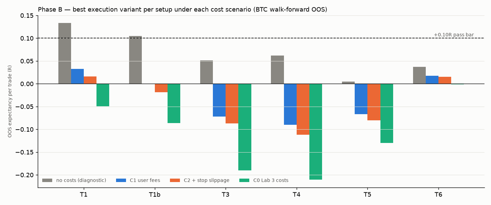
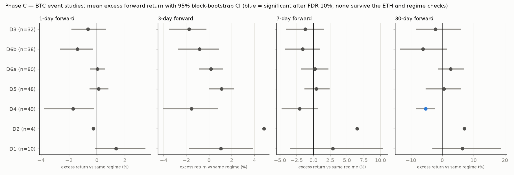
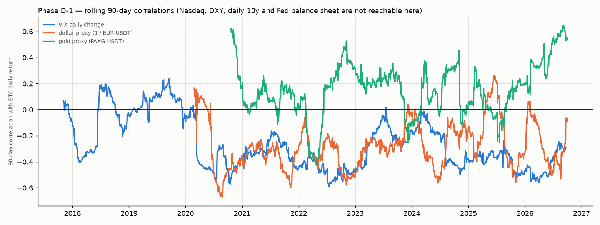
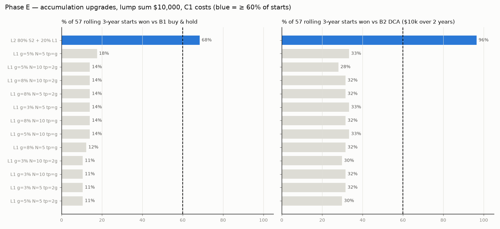

# Lab 4 — information, execution and macro: what gives a halal spot edge?

## Verdict

**Nothing short-term works, and no new information source helps. The only rules with support are the two slow accumulation rules from Lab 3, and they keep that support under your real fees.** Real execution (BNB-discounted 0.075% fees, limit ladders, partial exits) cuts the cost drag a lot. The best of Lab 3's setups rises from -0.094R to +0.016R per trade (T1, C2), still far below the +0.10R bar. Before costs most setups carried only +0.01R to +0.13R, so cost explains much of Lab 3's failure, but there was never enough edge to survive any realistic cost (T1 and T1b entries did beat random entries with the same execution, so the timing is not pure noise, but the edge is far too small). None of the 24 derivatives/flow event tests (funding, open interest, premium, long/short ratio, taker delta, liquidation-style flushes) survived the false-discovery, ETH and regime checks. Macro series available here (VIX, dollar and gold proxies) show unstable correlations and no forward information, and a macro size overlay did not improve S1 or S2. A spot grid ladder lost to buy & hold, DCA and S2 in most starts. What survives: weekly DCA scaled by the 200-week SMA (S2) beat plain DCA in 75% of rolling starts with a lower median drawdown (56% vs 73%); the 20-week SMA filter (S1) beat lump-sum buy & hold in 75% with median drawdown 46% vs 72%. Both rest on two or three overlapping market cycles, so they are frozen and must now prove themselves on forward data.

## Decision sheet

### 1. What to do with money now

**Weekly accumulation: S2 (200-week SMA multiplier, aggressive table)** — BTC spot, Binance, limit buy at the Monday open:

| BTC weekly close ÷ 200-week SMA | Weekly buy |
|---|---|
| below 1.5 | 3 × your base amount (funded from the cash reserve; if the reserve is short, buy what it holds) |
| 1.5 – 2.5 | 1 × base |
| 2.5 – 3.5 | 0.25 × base (save the rest) |
| above 3.5 | 0 × (save it all) and sell 10% of your BTC, at most once every 4 weeks |

State as of the week closing 2026-09-27: BTC 84,472, 200-week SMA 65,839, ratio **1.28 → buy 3× the base amount** this week. The reserve earns nothing (no Earn/staking), by design. Practical note: the ×3 tier spends a cash reserve saved in the expensive weeks; if you start now with no reserve, either set aside a few weeks of base amounts first or accept that ×3 weeks are capped by your cash.

**Lump sums: S1 (20-week SMA filter)** — hold BTC while the weekly close is above the 20-week SMA, otherwise hold cash; check on Mondays. Current state: weekly close 84,472 vs 20-week SMA 70,367 → **hold BTC**. Expect to give up return in strong bull runs in exchange for a much smaller drawdown.

Halal check: spot only, long only, no leverage, no lending/Earn/staking; idle cash earns 0%.

### 2. What goes to paper trading

**No mechanical short-term rule qualified.** Every setup failed at least five of the eight pass rules (table below). The least bad, T1, made +0.016R per trade at C2 after picking the best of 18 execution variants on the test data. That is noise-level and optimistic, so it is not a paper-trading candidate. If you paper-trade, trade your own discretionary ideas and record each one in `journal/` (schema + `scripts/journal_stats.py`). After 50 to 100 trades the journal answers whether *your* judgment beats +0.10R after fees.

### 3. What is dead and why

| Idea | Why it is dead |
|---|---|
| Lab 1 alt TA (pullback, breakout, base) | negative after costs on a survivorship-free universe |
| Lab 3 / Lab 4 short-term setups T1, T1b, T3, T4, T5, T6 | best execution variant still ≤ +0.016R per trade at C2, DSR ≈ 0, at least five of eight pass rules failed. T1 and T1b did beat 98th, 99th percentile of random entries with the same execution: their timing carries a little information, too little to pay for costs |
| T2 1-minute volume breakout | Lab 3: −0.41R; tight stops make costs ~0.7R per trade (not re-run) |
| Derivatives/flow signals D1–D6 | no FDR-significant signal with the right sign on BTC, the same sign on ETH and in 2 of 3 regimes; D4 'absorption' was significantly NEGATIVE (price kept falling) |
| Fear & Greed (D7), FOMC/CPI windows, ETF flows, Nasdaq/DXY/10y/Fed data | not testable here: sources blocked or not free (see the data inventory) |
| Macro regime and macro size overlay | no forward difference (CI spans zero); overlay worse than plain S1 and no better than plain S2 |
| Spot grid ladder (L1) | beats buy & hold in ≤ 18% of starts; capital idle; lots underwater for up to ~3 years |
| S2 + ladder hybrid (L2), S2 + crowding overlay (L3) | L2 only dilutes S2; L3 is S2 in 93% of starts |
| Market gate A2 (Lab 3) | failed in both frames |

## Phase A — data

See `reports/lab4_data_inventory.md`. Available: Binance spot klines with taker-buy volume, USD-M funding, premium index and 5-minute metrics (open interest, long/short ratios, taker ratio), VIX daily, monthly 10y, PAXG/USDT (gold proxy) and EUR/USDT (dollar proxy). Blocked or not free here: Fear & Greed, FRED daily series, Nasdaq/QQQ, DXY, FOMC/CPI calendars, ETF flows, liquidation history, unlock history.

## Phase B — Lab 3 setups with real execution

Each setup's frozen Lab 3 rules and grid, walk-forward 12m/3m on BTC (2021-01 → 2025-09 OOS), for every entry ladder × exit × stop combination (18) under C0, C1 and C2 with trade-through fills; 1695 configurations in all. The best variant per setup (by C2 OOS expectancy) is then checked against all pass rules; DSR counts 1920 configurations across Labs 3 and 4.

| Setup | Best variant | OOS trades | Expectancy C2 | PF C2 | vs random | DSR | ETH C2 | Expectancy C0 | Months up | Verdict |
|---|---|---|---|---|---|---|---|---|---|---|
| **T1** | `E1/X2/S-a` | 242 | +0.016R | 1.03 | 98th | 0.00 | +0.096R | -0.050R | 56% | **FAIL** |
| **T1b** | `E1/X3/S-b` | 323 | -0.019R | 0.96 | 99th | 0.00 | +0.046R | -0.087R | 52% | **FAIL** |
| **T3** | `E2/X2/S-b` | 369 | -0.087R | 0.80 | 89th | 0.00 | -0.127R | -0.190R | 43% | **FAIL** |
| **T4** | `E1/X2/S-b` | 242 | -0.112R | 0.81 | 83rd | 0.00 | -0.071R | -0.211R | 39% | **FAIL** |
| **T5** | `E2/X3/S-b` | 437 | -0.080R | 0.83 | 55th | 0.00 | -0.141R | -0.130R | 37% | **FAIL** |
| **T6** | `own 4-tranche ladder` | 99 | +0.015R | 1.05 | – | 0.00 | -0.059R | -0.001R | 50% | **FAIL** |

**How much was cost, how much no edge** (same walk-forward, best variant):

| Setup | Lab 3 (market orders, C0) | No costs | C1 user | C2 user + stop slip | C0 with limits | C1 with touch fills |
|---|---|---|---|---|---|---|
| T1 | -0.094R | +0.133R | +0.033R | +0.016R | -0.050R | +0.054R |
| T1b | -0.211R | +0.105R | -0.000R | -0.019R | -0.087R | +0.015R |
| T3 | -0.179R | +0.052R | -0.072R | -0.087R | -0.190R | -0.062R |
| T4 | -0.324R | +0.062R | -0.090R | -0.112R | -0.211R | -0.083R |
| T5 | -0.127R | +0.005R | -0.067R | -0.080R | -0.130R | -0.112R |
| T6 | -0.001R | +0.037R | +0.017R | +0.015R | -0.001R | +0.017R |

**Execution modes** (mean OOS expectancy across T1, T1b, T3, T4, T5 under C1):

| Entry | Expectancy |
|---|---|
| E1 | -0.117R |
| E2 | -0.108R |
| E3 | -0.149R |

| Exit | Expectancy |
|---|---|
| X1 | -0.129R |
| X2 | -0.128R |
| X3 | -0.117R |

| Stop | Expectancy |
|---|---|
| S-a | -0.124R |
| S-b | -0.126R |

Read: going from Lab 3 to your execution (C1) improves the best variant of each setup by +0.02R to +0.23R per trade. Part of that is choosing the best of 18 variants; the pure fee/slippage effect (C0 → C1, same variant and limit entries) is +0.02R to +0.12R. Exit style barely matters (X1 -0.129R, X2 -0.128R, X3 -0.117R: moving the stop to breakeven after the first third helps a little). E2 (0.09% ladder) is marginally better than one limit (-0.108R vs -0.117R); a wide ATR ladder (E3) is worse (-0.149R), consistent with adverse selection (deep levels fill mostly when price keeps falling). Stop placement makes no difference (-0.124R vs -0.126R). Touch fills change results by -0.05R to +0.02R: mixed, not uniformly flattering. Verdicts use trade-through. None of this creates an edge that clears the bar.

Full grid: `reports/lab4_phaseB_grid.csv`.

## Phase C — derivatives and flow signals (event studies)

Forward spot return after each event vs the unconditional return in the same BTC 200-day regime; 95% block-bootstrap CI; Benjamini–Hochberg FDR at 10% over all BTC tests with ≥ 10 events; then the same sign on ETH and in ≥ 2 of 3 regimes (bull / bear / range by the 20-day slope of the 200-day SMA). Thresholds are expanding percentiles (≥ 180 observations).

| Signal | Days | Events | Mean excess | 95% CI | p | FDR | Expected sign | ETH | Regimes same sign | Survives |
|---|---|---|---|---|---|---|---|---|---|---|
| D1 | 1 | 10 | +1.38% | [-0.14%, +3.48%] | 0.097 | – | ✅ | -0.77% | 1 | ❌ |
| D1 | 3 | 10 | +1.06% | [-1.79%, +3.89%] | 0.484 | – | ✅ | -3.44% | 0 | ❌ |
| D1 | 7 | 10 | +2.91% | [-3.48%, +10.34%] | 0.446 | – | ✅ | -1.51% | 0 | ❌ |
| D1 | 30 | 10 | +6.49% | [-3.13%, +18.88%] | 0.283 | – | ✅ | -6.18% | 0 | ❌ |
| D2 | 1 | 4 | -0.24% | – (too few events) | – | – | ✅ | – | 0 | ❌ |
| D2 | 3 | 4 | +4.86% | – (too few events) | – | – | ❌ | – | 0 | ❌ |
| D2 | 7 | 4 | +6.54% | – (too few events) | – | – | ❌ | – | 0 | ❌ |
| D2 | 30 | 4 | +7.12% | – (too few events) | – | – | ❌ | – | 0 | ❌ |
| D4 | 1 | 49 | -1.69% | [-3.76%, -0.22%] | 0.013 | – | ❌ | -1.57% | 3 | ❌ |
| D4 | 3 | 49 | -1.53% | [-4.06%, +0.77%] | 0.204 | – | ❌ | -2.17% | 2 | ❌ |
| D4 | 7 | 49 | -2.04% | [-4.76%, +0.63%] | 0.134 | – | ❌ | -3.20% | 3 | ❌ |
| D4 | 30 | 48 | -5.25% | [-8.23%, -2.24%] | 0.000 | ✅ | ❌ | -7.83% | 3 | ❌ |
| D5 | 1 | 48 | +0.13% | [-0.52%, +0.83%] | 0.731 | – | ✅ | +0.34% | 1 | ❌ |
| D5 | 3 | 48 | +1.12% | [+0.02%, +2.22%] | 0.048 | – | ✅ | +0.87% | 3 | ❌ |
| D5 | 7 | 48 | +0.45% | [-1.36%, +2.41%] | 0.655 | – | ✅ | +0.93% | 3 | ❌ |
| D5 | 30 | 48 | +0.58% | [-5.28%, +6.07%] | 0.812 | – | ✅ | -0.68% | 1 | ❌ |
| D6a | 1 | 80 | +0.05% | [-0.49%, +0.60%] | 0.892 | – | ✅ | -0.10% | 2 | ❌ |
| D6a | 3 | 80 | +0.18% | [-0.87%, +1.22%] | 0.747 | – | ✅ | +0.92% | 2 | ❌ |
| D6a | 7 | 80 | +0.25% | [-1.82%, +2.26%] | 0.808 | – | ✅ | +2.25% | 1 | ❌ |
| D6a | 30 | 79 | +2.72% | [-1.28%, +6.96%] | 0.196 | – | ✅ | +4.85% | 2 | ❌ |
| D6b | 1 | 38 | -1.38% | [-2.65%, -0.27%] | 0.012 | – | ✅ | +0.58% | 3 | ❌ |
| D6b | 3 | 38 | -0.82% | [-2.73%, +0.89%] | 0.390 | – | ✅ | -0.05% | 3 | ❌ |
| D6b | 7 | 38 | -1.59% | [-4.29%, +1.01%] | 0.231 | – | ✅ | -0.74% | 2 | ❌ |
| D6b | 30 | 38 | -6.10% | [-13.42%, +1.57%] | 0.121 | – | ✅ | -2.25% | 3 | ❌ |
| D3 | 1 | 32 | -0.63% | [-1.82%, +0.65%] | 0.327 | – | ❌ | +0.48% | 2 | ❌ |
| D3 | 3 | 32 | -1.74% | [-3.52%, -0.21%] | 0.023 | – | ❌ | -0.55% | 2 | ❌ |
| D3 | 7 | 32 | -1.21% | [-4.13%, +1.58%] | 0.411 | – | ❌ | -0.38% | 2 | ❌ |
| D3 | 30 | 32 | -2.12% | [-8.23%, +6.11%] | 0.553 | – | ❌ | -2.42% | 2 | ❌ |

Signals: **D1** crowded shorts: 3-day mean funding < 10th pct while BTC > 200d SMA (buy); **D2** overheated longs: daily funding > 95th pct AND open interest at a 90-day high (reduce); **D3** flush: 4h OI drop <= 5th pct with a >= 2 ATR price drop, then a close back above the pre-flush low; **D4** absorption: price makes a 20-day lower low while cumulative spot taker delta makes a higher low; **D5** discount basis: perp premium index < 5th pct; **D6a** crowd short: global long/short account ratio < 10th pct (contrarian buy); **D6b** crowd long: global long/short account ratio > 90th pct (contrarian reduce). D7 (Fear & Greed) skipped: no data. Because nothing survived, the tradable-rule walk-forward of Phase C had nothing to run.

## Phase D — macro

| Series vs BTC (90-day rolling corr.) | From | Mean | Std | Min | Max | Share > 0 | Sign flips |
|---|---|---|---|---|---|---|---|
| dollar_proxy | 2020-02-26 | -0.28 | 0.18 | -0.67 | +0.26 | 8% | 17 |
| gold_proxy | 2020-10-21 | +0.16 | 0.20 | -0.43 | +0.64 | 81% | 34 |
| VIX_change | 2017-11-02 | -0.27 | 0.20 | -0.59 | +0.24 | 14% | 23 |

US 10y (monthly only): correlation of monthly BTC returns with the yield change +0.04 over 110 months; rolling 24-month range -0.28 … +0.54.

| Macro regime (known at day end) | Days | Mean 30-day forward BTC | 95% CI |
|---|---|---|---|
| risk-on (dollar proxy down & VIX < 200d SMA) | 803 | +3.8% | [-2.0%, +10.6%] |
| rest | 1611 | +4.7% | [+0.8%, +8.7%] |
| difference (risk-on − rest) | 2414 | -1.0% | [-8.0%, +6.7%] |

Macro overlay (VIX-only risk-on score; Nasdaq and DXY unavailable), rolling starts at C1:

| Frame | Rule | Starts won vs benchmark | Median max DD (vs bench) | Verdict |
|---|---|---|---|---|
| A | S1 20w | 75% | 46% vs 72% | PASS |
| A | S1 20w + macro | 14% | 25% vs 72% | FAIL |
| B | S2 aggressive | 75% | 56% vs 73% | PASS |
| B | S2 aggressive + macro | 77% | 54% vs 73% | PASS |

| Overlay | Starts better than the plain rule | Median Δ value÷contrib. vs plain |
|---|---|---|
| S1 20w + macro | 7% | -2.38 |
| S2 aggressive + macro | 30% | -0.06 |

D-3 (FOMC/CPI event windows) and D-4 (calendar filter) skipped: the official calendars are not reachable here and typing dates from memory would risk fabricated data; no short-term rule is alive to filter anyway.

## Phase E — accumulation upgrades (lump sum $10,000, rolling starts, C1)

| Rule | Won vs B1 | Won vs B2 | Won vs S2 | Median DD | Median invested | Longest lot underwater | Median round trips | Verdict vs B1 |
|---|---|---|---|---|---|---|---|---|
| L2 80% S2 + 20% L1 | 68% | 96% | 5% | 42% | – | – | – | PASS |
| L1 g=5% N=5 tp=g | 18% | 33% | 9% | 45% | 47% | 1043 d | 151 | FAIL |
| L1 g=3% N=5 tp=g | 14% | 33% | 7% | 47% | 48% | 1043 d | 264 | FAIL |
| L1 g=5% N=10 tp=g | 14% | 33% | 5% | 39% | 39% | 1043 d | 204 | FAIL |
| L1 g=8% N=5 tp=2g | 14% | 32% | 5% | 43% | 47% | 1044 d | 36 | FAIL |
| L1 g=8% N=10 tp=g | 14% | 32% | 5% | 32% | 32% | 1043 d | 111 | FAIL |
| L1 g=8% N=10 tp=2g | 14% | 32% | 2% | 34% | 34% | 1044 d | 53 | FAIL |
| L1 g=5% N=10 tp=2g | 14% | 28% | 0% | 40% | 42% | 1062 d | 90 | FAIL |
| L1 g=8% N=5 tp=g | 12% | 32% | 5% | 42% | 44% | 1043 d | 72 | FAIL |
| L1 g=3% N=10 tp=2g | 11% | 30% | 5% | 43% | 48% | 1043 d | 200 | FAIL |
| L1 g=3% N=10 tp=g | 11% | 32% | 5% | 42% | 44% | 1043 d | 432 | FAIL |
| L1 g=3% N=5 tp=2g | 11% | 32% | 7% | 49% | 49% | 1043 d | 118 | FAIL |
| L1 g=5% N=5 tp=2g | 11% | 30% | 5% | 45% | 49% | 1062 d | 66 | FAIL |

For reference, S2 itself (lump-sum version) beat B1 in 70% of starts. Median drawdown B1 72%, B2 54%.

L3 (S2 × crowding overlay, weekly frame): identical to S2 in 93% of starts; better than S2 in 7% (from 2020-12, when the data exists: 0% of 22 starts). L4 (unlock filter) skipped: no free historical unlock data.

## Phase F — forward logging and the journal

- `scripts/daily_logger.py` — run daily at 00:10 UTC (cron line in the script; a GitHub Actions file to copy is in `ops/`). Appends funding, open interest, long/short ratios, taker ratio, premium, spot taker delta and Fear & Greed to `data/forward/market.csv`, and the live state of every frozen rule (S2 multiplier, S1 filter) to `data/forward/rules.csv`. Liquidations are not logged (Binance's force-order endpoint needs an API key).
- `journal/` — CSV schema for paper trades (thesis, data seen, ladder prices and fills, stop, targets, exits, fees, result in R, discipline and emotion); `scripts/journal_stats.py` gives expectancy, PF, win rate, average R and the longest losing streak, overall and by setup, regime, discipline and emotion.

## Phase G — pass rules and freezing

Short-term rules needed: OOS expectancy > 0.10R at C2 and > 0 at C0, PF > 1.2, ≥ 100 trades (≥ 40 on daily bars), > 95th pct of random entries, DSR > 0.95, ETH > 0, ≥ 60% profitable months. None passed. Accumulation rules needed ≥ 60% of rolling starts won with a lower median drawdown under C1: S2 (weekly) and S1 (lump sum) pass and are frozen in `reports/lab4_frozen.json`. No unseen historical holdout remains, so the forward log is the holdout: re-check S1/S2 against plain DCA / buy & hold after ≥ 3 months of `data/forward/` data. The verdict is final only then.

T1: FAIL

| Rule | Pass | Value |
|---|---|---|
| OOS expectancy > 0.10R (C2) | ❌ | +0.016R |
| expectancy > 0 (C0) | ❌ | -0.050R |
| profit factor > 1.2 (C2) | ❌ | 1.03 |
| ≥ 100 OOS trades | ✅ | 242 |
| > 95th pct random entries | ✅ | 98th |
| DSR > 0.95 | ❌ | 0.00 |
| ETH expectancy > 0 (C2) | ✅ | +0.096R |
| ≥ 60% profitable months | ❌ | 56% |

T1b: FAIL

| Rule | Pass | Value |
|---|---|---|
| OOS expectancy > 0.10R (C2) | ❌ | -0.019R |
| expectancy > 0 (C0) | ❌ | -0.087R |
| profit factor > 1.2 (C2) | ❌ | 0.96 |
| ≥ 100 OOS trades | ✅ | 323 |
| > 95th pct random entries | ✅ | 99th |
| DSR > 0.95 | ❌ | 0.00 |
| ETH expectancy > 0 (C2) | ✅ | +0.046R |
| ≥ 60% profitable months | ❌ | 52% |

T3: FAIL

| Rule | Pass | Value |
|---|---|---|
| OOS expectancy > 0.10R (C2) | ❌ | -0.087R |
| expectancy > 0 (C0) | ❌ | -0.190R |
| profit factor > 1.2 (C2) | ❌ | 0.80 |
| ≥ 100 OOS trades | ✅ | 369 |
| > 95th pct random entries | ❌ | 89th |
| DSR > 0.95 | ❌ | 0.00 |
| ETH expectancy > 0 (C2) | ❌ | -0.127R |
| ≥ 60% profitable months | ❌ | 43% |

T4: FAIL

| Rule | Pass | Value |
|---|---|---|
| OOS expectancy > 0.10R (C2) | ❌ | -0.112R |
| expectancy > 0 (C0) | ❌ | -0.211R |
| profit factor > 1.2 (C2) | ❌ | 0.81 |
| ≥ 100 OOS trades | ✅ | 242 |
| > 95th pct random entries | ❌ | 83rd |
| DSR > 0.95 | ❌ | 0.00 |
| ETH expectancy > 0 (C2) | ❌ | -0.071R |
| ≥ 60% profitable months | ❌ | 39% |

T5: FAIL

| Rule | Pass | Value |
|---|---|---|
| OOS expectancy > 0.10R (C2) | ❌ | -0.080R |
| expectancy > 0 (C0) | ❌ | -0.130R |
| profit factor > 1.2 (C2) | ❌ | 0.83 |
| ≥ 100 OOS trades | ✅ | 437 |
| > 95th pct random entries | ❌ | 55th |
| DSR > 0.95 | ❌ | 0.00 |
| ETH expectancy > 0 (C2) | ❌ | -0.141R |
| ≥ 60% profitable months | ❌ | 37% |

T6: FAIL

| Rule | Pass | Value |
|---|---|---|
| OOS expectancy > 0.10R (C2) | ❌ | +0.015R |
| expectancy > 0 (C0) | ❌ | -0.001R |
| profit factor > 1.2 (C2) | ❌ | 1.05 |
| ≥ 100 OOS trades | ❌ | 99 |
| > 95th pct random entries | ❌ | – |
| DSR > 0.95 | ❌ | 0.00 |
| ETH expectancy > 0 (C2) | ❌ | -0.059R |
| ≥ 60% profitable months | ❌ | 50% |

## Data gaps and assumptions

- Holdout: Lab 3's 2025-10 → 2026-09 period has been seen. Phase B keeps Lab 3's 2020-01 → 2025-09 walk-forward; event studies (C), macro (D) use data up to 2026-09-30; rolling starts (D-5, E) end by 2025-09-30.
- Point-in-time: funding is used from its settlement timestamp, open interest and ratios from their 5-minute snapshot time (stale > 6 h = missing), premium-index and spot klines from their close, VIX from 00:00 UTC after its US session. Tests cover the as-of alignment, append-one-day invariance of every signal, and the VIX timing.
- Execution model: limit entries live for 3 bars (T4: 100 bars and cancelled by a close below the zone); trade-through = 0.02% beyond the limit; no partial fills or queue position; a bar with an entry fill can stop out but not take profit; ladder R is measured against the risk of the full ladder, so partial fills risk less. S-c (stops below liquidation clusters) is not testable without liquidation data.
- The best execution variant per setup was chosen on OOS results (as the task asks for the comparison). That flatters it, and the DSR counts every configuration tried.
- T6 keeps its own 4-tranche ladder and base exit; only costs and fill models change. Its random baseline is not computed (no single-entry analogue).
- Accumulation under C1: weekly limit buys at the Monday open at 0.075% fee, no slippage. Lump-sum B2 deploys $10,000 over 104 weeks (Lab 2 definition). The ladder runs on 1h bars, everything else on daily bars.
- Macro proxies: dollar = 1/EUR-USDT, gold = PAXG/USDT, VIX via DataHub's CBOE copy; correlations are descriptive (same-date returns), the regime and overlay use only values known before each decision.
- Rolling starts overlap heavily (about 2.6 independent 3-year periods), so accumulation evidence rests on two or three market cycles.
